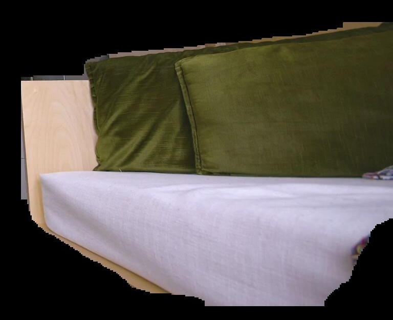
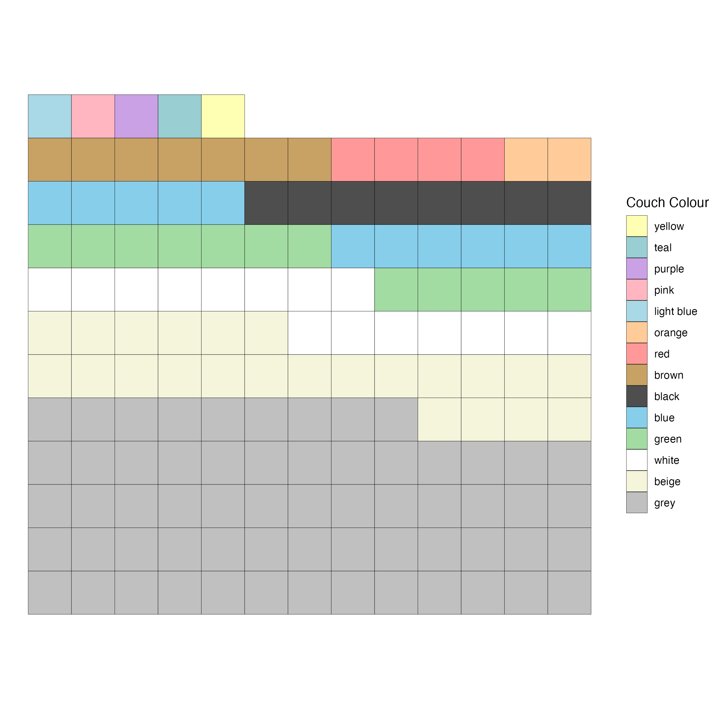

## Intro

I really enjoy watching the YouTube channel [NeverTooSmall](https://www.nevertoosmall.com/), which showcases cleverly designed small spaces from around the world.

I was watching an episode with my girlfriend recently when she remarked, “Doesn’t it feel like every second couch is a boring grey one on this channel? Why can’t they choose some more fun colors?!”

<iframe width="640" height="360" src="https://www.youtube.com/embed/KXNIx4sfzns?si=fzW2P-jG3r8xTAds&amp;controls=0&amp;start=80" title="YouTube video player" frameborder="0" allow="accelerometer; autoplay; clipboard-write; encrypted-media; gyroscope; picture-in-picture; web-share" referrerpolicy="strict-origin-when-cross-origin" allowfullscreen></iframe>

There are probably a couple of practical reasons people might go for a grey couch. For one, in a small space, a bold color can quickly overpower the room. And secondly, grey doesn’t show wear and discoloration as easily as white, which is often a popular choice for its stylish look.

But Kathy’s comment sent me down a rabbit hole. I wanted to find out how many of the couches on NeverTooSmall were actually grey. 

My close friend and flatmate duing my Master's degree, Nick, once confidently said regarding his interest in audio processing that, “Computer vision is a solved field”—and that was five years ago! So I thought, how hard could it be to use a small, open-source, CPU-based computer vision model to analyze the videos from NeverTooSmall, identify the frames with a couch, extract its color, and visualize the results in a nice waffle chart?

It turns out, it’s not that hard. In this post, I’ll share the answer to my question and, if you're interested, explain the technical steps I took to get there.


::: {.cell}

```{.r .cell-code}
library(tidyverse)
library(jsonlite)
library(gt)

df <- fromJSON("data/couch_info_with_colour_classifications.json")

df <- as_tibble(df)

n_videos <- nrow(df)

n_couches <- nrow(df %>% filter(couch_detected))

n_grey_couches <- nrow(df %>% filter(couch_detected, couch_colour == "grey"))


color_mapping <- c(
    "beige" = "#F5F5DC", # Soft beige
    "light blue" = "#A9D8E6", # Lightened sky blue
    "green" = "#A3DCA3", # Soft pastel green
    "grey" = "#C0C0C0", # Light grey
    "blue" = "#87CEEB", # Light blue
    "black" = "#4E4E4E", # Dark grey to represent pastel black
    "brown" = "#C8A165", # Light brown
    "white" = "#FFFFFF", # White
    "red" = "#FF9999", # Lightened true red
    "yellow" = "#FFFFB3", # Soft pastel yellow
    "teal" = "#99CED3", # Soft teal
    "orange" = "#FFCC99", # Lightened orange
    "pink" = "#FFB6C1", # Soft pink
    "purple" = "#CBA1E6" # Light purple
)


# Expand the data to repeat each color based on the count
expanded_df <- df %>%
    count(couch_colour) %>%
    filter(!is.na(couch_colour)) %>%
    arrange(desc(n)) %>%
    uncount(n) %>%
    mutate(tile_id = row_number())

# Calculate the number of columns and rows for the grid
n_cols <- ceiling(sqrt(nrow(expanded_df)))

# Create a grid with the colors
grid <- expand.grid(x = 1:n_cols, y = 1:n_cols) %>%
    slice(1:nrow(expanded_df)) %>%
    bind_cols(expanded_df)

# Create legend order using number of couches
legend_order <- expanded_df %>%
    group_by(couch_colour) %>%
    summarise(n = n()) %>%
    arrange(desc(n)) %>%
    pull(couch_colour)

# Plot the grid with colors
grid %>%
    ggplot(aes(x = x, y = y, fill = factor(couch_colour, levels = legend_order))) +
    geom_tile(color = "black") +
    scale_fill_manual(values = color_mapping) +
    theme_void() +
    coord_fixed() +
    labs(
        # title = "The colours of the couches in NeverTooSmall videos",
        fill = "Couch Colour"
    ) +
    guides(fill = guide_legend(reverse = TRUE))
```

::: {.cell-output-display}
{width=672}
:::
:::


**Spoiler Alert:** Out of the 189 videos on the channel, I identified 148 couches, and 61 of them were grey! That’s nearly three times the next most common color, beige, and four times the third most common color, white.

:::{.column-margin}


::: {.cell}

```{.r .cell-code}
df %>%
    count(couch_colour, sort = TRUE) %>%
    mutate(couch_colour = str_to_title(couch_colour)) %>%
    replace_na(list(couch_colour = "No couch")) %>%
    gt() %>%
    tab_options(column_labels.hidden = TRUE) %>%
    tab_header(title = md("**[NeverTooSmall](https://www.nevertoosmall.com/) Couches**"))
```

::: {.cell-output-display}


```{=html}
<div id="hwlzmqfgws" style="padding-left:0px;padding-right:0px;padding-top:10px;padding-bottom:10px;overflow-x:auto;overflow-y:auto;width:auto;height:auto;">
<style>#hwlzmqfgws table {
  font-family: system-ui, 'Segoe UI', Roboto, Helvetica, Arial, sans-serif, 'Apple Color Emoji', 'Segoe UI Emoji', 'Segoe UI Symbol', 'Noto Color Emoji';
  -webkit-font-smoothing: antialiased;
  -moz-osx-font-smoothing: grayscale;
}

#hwlzmqfgws thead, #hwlzmqfgws tbody, #hwlzmqfgws tfoot, #hwlzmqfgws tr, #hwlzmqfgws td, #hwlzmqfgws th {
  border-style: none;
}

#hwlzmqfgws p {
  margin: 0;
  padding: 0;
}

#hwlzmqfgws .gt_table {
  display: table;
  border-collapse: collapse;
  line-height: normal;
  margin-left: auto;
  margin-right: auto;
  color: #333333;
  font-size: 16px;
  font-weight: normal;
  font-style: normal;
  background-color: #FFFFFF;
  width: auto;
  border-top-style: solid;
  border-top-width: 2px;
  border-top-color: #A8A8A8;
  border-right-style: none;
  border-right-width: 2px;
  border-right-color: #D3D3D3;
  border-bottom-style: solid;
  border-bottom-width: 2px;
  border-bottom-color: #A8A8A8;
  border-left-style: none;
  border-left-width: 2px;
  border-left-color: #D3D3D3;
}

#hwlzmqfgws .gt_caption {
  padding-top: 4px;
  padding-bottom: 4px;
}

#hwlzmqfgws .gt_title {
  color: #333333;
  font-size: 125%;
  font-weight: initial;
  padding-top: 4px;
  padding-bottom: 4px;
  padding-left: 5px;
  padding-right: 5px;
  border-bottom-color: #FFFFFF;
  border-bottom-width: 0;
}

#hwlzmqfgws .gt_subtitle {
  color: #333333;
  font-size: 85%;
  font-weight: initial;
  padding-top: 3px;
  padding-bottom: 5px;
  padding-left: 5px;
  padding-right: 5px;
  border-top-color: #FFFFFF;
  border-top-width: 0;
}

#hwlzmqfgws .gt_heading {
  background-color: #FFFFFF;
  text-align: center;
  border-bottom-color: #FFFFFF;
  border-left-style: none;
  border-left-width: 1px;
  border-left-color: #D3D3D3;
  border-right-style: none;
  border-right-width: 1px;
  border-right-color: #D3D3D3;
}

#hwlzmqfgws .gt_bottom_border {
  border-bottom-style: solid;
  border-bottom-width: 2px;
  border-bottom-color: #D3D3D3;
}

#hwlzmqfgws .gt_col_headings {
  border-top-style: solid;
  border-top-width: 2px;
  border-top-color: #D3D3D3;
  border-bottom-style: solid;
  border-bottom-width: 2px;
  border-bottom-color: #D3D3D3;
  border-left-style: none;
  border-left-width: 1px;
  border-left-color: #D3D3D3;
  border-right-style: none;
  border-right-width: 1px;
  border-right-color: #D3D3D3;
}

#hwlzmqfgws .gt_col_heading {
  color: #333333;
  background-color: #FFFFFF;
  font-size: 100%;
  font-weight: normal;
  text-transform: inherit;
  border-left-style: none;
  border-left-width: 1px;
  border-left-color: #D3D3D3;
  border-right-style: none;
  border-right-width: 1px;
  border-right-color: #D3D3D3;
  vertical-align: bottom;
  padding-top: 5px;
  padding-bottom: 6px;
  padding-left: 5px;
  padding-right: 5px;
  overflow-x: hidden;
}

#hwlzmqfgws .gt_column_spanner_outer {
  color: #333333;
  background-color: #FFFFFF;
  font-size: 100%;
  font-weight: normal;
  text-transform: inherit;
  padding-top: 0;
  padding-bottom: 0;
  padding-left: 4px;
  padding-right: 4px;
}

#hwlzmqfgws .gt_column_spanner_outer:first-child {
  padding-left: 0;
}

#hwlzmqfgws .gt_column_spanner_outer:last-child {
  padding-right: 0;
}

#hwlzmqfgws .gt_column_spanner {
  border-bottom-style: solid;
  border-bottom-width: 2px;
  border-bottom-color: #D3D3D3;
  vertical-align: bottom;
  padding-top: 5px;
  padding-bottom: 5px;
  overflow-x: hidden;
  display: inline-block;
  width: 100%;
}

#hwlzmqfgws .gt_spanner_row {
  border-bottom-style: hidden;
}

#hwlzmqfgws .gt_group_heading {
  padding-top: 8px;
  padding-bottom: 8px;
  padding-left: 5px;
  padding-right: 5px;
  color: #333333;
  background-color: #FFFFFF;
  font-size: 100%;
  font-weight: initial;
  text-transform: inherit;
  border-top-style: solid;
  border-top-width: 2px;
  border-top-color: #D3D3D3;
  border-bottom-style: solid;
  border-bottom-width: 2px;
  border-bottom-color: #D3D3D3;
  border-left-style: none;
  border-left-width: 1px;
  border-left-color: #D3D3D3;
  border-right-style: none;
  border-right-width: 1px;
  border-right-color: #D3D3D3;
  vertical-align: middle;
  text-align: left;
}

#hwlzmqfgws .gt_empty_group_heading {
  padding: 0.5px;
  color: #333333;
  background-color: #FFFFFF;
  font-size: 100%;
  font-weight: initial;
  border-top-style: solid;
  border-top-width: 2px;
  border-top-color: #D3D3D3;
  border-bottom-style: solid;
  border-bottom-width: 2px;
  border-bottom-color: #D3D3D3;
  vertical-align: middle;
}

#hwlzmqfgws .gt_from_md > :first-child {
  margin-top: 0;
}

#hwlzmqfgws .gt_from_md > :last-child {
  margin-bottom: 0;
}

#hwlzmqfgws .gt_row {
  padding-top: 8px;
  padding-bottom: 8px;
  padding-left: 5px;
  padding-right: 5px;
  margin: 10px;
  border-top-style: solid;
  border-top-width: 1px;
  border-top-color: #D3D3D3;
  border-left-style: none;
  border-left-width: 1px;
  border-left-color: #D3D3D3;
  border-right-style: none;
  border-right-width: 1px;
  border-right-color: #D3D3D3;
  vertical-align: middle;
  overflow-x: hidden;
}

#hwlzmqfgws .gt_stub {
  color: #333333;
  background-color: #FFFFFF;
  font-size: 100%;
  font-weight: initial;
  text-transform: inherit;
  border-right-style: solid;
  border-right-width: 2px;
  border-right-color: #D3D3D3;
  padding-left: 5px;
  padding-right: 5px;
}

#hwlzmqfgws .gt_stub_row_group {
  color: #333333;
  background-color: #FFFFFF;
  font-size: 100%;
  font-weight: initial;
  text-transform: inherit;
  border-right-style: solid;
  border-right-width: 2px;
  border-right-color: #D3D3D3;
  padding-left: 5px;
  padding-right: 5px;
  vertical-align: top;
}

#hwlzmqfgws .gt_row_group_first td {
  border-top-width: 2px;
}

#hwlzmqfgws .gt_row_group_first th {
  border-top-width: 2px;
}

#hwlzmqfgws .gt_summary_row {
  color: #333333;
  background-color: #FFFFFF;
  text-transform: inherit;
  padding-top: 8px;
  padding-bottom: 8px;
  padding-left: 5px;
  padding-right: 5px;
}

#hwlzmqfgws .gt_first_summary_row {
  border-top-style: solid;
  border-top-color: #D3D3D3;
}

#hwlzmqfgws .gt_first_summary_row.thick {
  border-top-width: 2px;
}

#hwlzmqfgws .gt_last_summary_row {
  padding-top: 8px;
  padding-bottom: 8px;
  padding-left: 5px;
  padding-right: 5px;
  border-bottom-style: solid;
  border-bottom-width: 2px;
  border-bottom-color: #D3D3D3;
}

#hwlzmqfgws .gt_grand_summary_row {
  color: #333333;
  background-color: #FFFFFF;
  text-transform: inherit;
  padding-top: 8px;
  padding-bottom: 8px;
  padding-left: 5px;
  padding-right: 5px;
}

#hwlzmqfgws .gt_first_grand_summary_row {
  padding-top: 8px;
  padding-bottom: 8px;
  padding-left: 5px;
  padding-right: 5px;
  border-top-style: double;
  border-top-width: 6px;
  border-top-color: #D3D3D3;
}

#hwlzmqfgws .gt_last_grand_summary_row_top {
  padding-top: 8px;
  padding-bottom: 8px;
  padding-left: 5px;
  padding-right: 5px;
  border-bottom-style: double;
  border-bottom-width: 6px;
  border-bottom-color: #D3D3D3;
}

#hwlzmqfgws .gt_striped {
  background-color: rgba(128, 128, 128, 0.05);
}

#hwlzmqfgws .gt_table_body {
  border-top-style: solid;
  border-top-width: 2px;
  border-top-color: #D3D3D3;
  border-bottom-style: solid;
  border-bottom-width: 2px;
  border-bottom-color: #D3D3D3;
}

#hwlzmqfgws .gt_footnotes {
  color: #333333;
  background-color: #FFFFFF;
  border-bottom-style: none;
  border-bottom-width: 2px;
  border-bottom-color: #D3D3D3;
  border-left-style: none;
  border-left-width: 2px;
  border-left-color: #D3D3D3;
  border-right-style: none;
  border-right-width: 2px;
  border-right-color: #D3D3D3;
}

#hwlzmqfgws .gt_footnote {
  margin: 0px;
  font-size: 90%;
  padding-top: 4px;
  padding-bottom: 4px;
  padding-left: 5px;
  padding-right: 5px;
}

#hwlzmqfgws .gt_sourcenotes {
  color: #333333;
  background-color: #FFFFFF;
  border-bottom-style: none;
  border-bottom-width: 2px;
  border-bottom-color: #D3D3D3;
  border-left-style: none;
  border-left-width: 2px;
  border-left-color: #D3D3D3;
  border-right-style: none;
  border-right-width: 2px;
  border-right-color: #D3D3D3;
}

#hwlzmqfgws .gt_sourcenote {
  font-size: 90%;
  padding-top: 4px;
  padding-bottom: 4px;
  padding-left: 5px;
  padding-right: 5px;
}

#hwlzmqfgws .gt_left {
  text-align: left;
}

#hwlzmqfgws .gt_center {
  text-align: center;
}

#hwlzmqfgws .gt_right {
  text-align: right;
  font-variant-numeric: tabular-nums;
}

#hwlzmqfgws .gt_font_normal {
  font-weight: normal;
}

#hwlzmqfgws .gt_font_bold {
  font-weight: bold;
}

#hwlzmqfgws .gt_font_italic {
  font-style: italic;
}

#hwlzmqfgws .gt_super {
  font-size: 65%;
}

#hwlzmqfgws .gt_footnote_marks {
  font-size: 75%;
  vertical-align: 0.4em;
  position: initial;
}

#hwlzmqfgws .gt_asterisk {
  font-size: 100%;
  vertical-align: 0;
}

#hwlzmqfgws .gt_indent_1 {
  text-indent: 5px;
}

#hwlzmqfgws .gt_indent_2 {
  text-indent: 10px;
}

#hwlzmqfgws .gt_indent_3 {
  text-indent: 15px;
}

#hwlzmqfgws .gt_indent_4 {
  text-indent: 20px;
}

#hwlzmqfgws .gt_indent_5 {
  text-indent: 25px;
}
</style>
<table class="gt_table" data-quarto-disable-processing="false" data-quarto-bootstrap="false">
  <thead>
    <tr class="gt_heading">
      <td colspan="2" class="gt_heading gt_title gt_font_normal gt_bottom_border" style><strong><a href="https://www.nevertoosmall.com/">NeverTooSmall</a> Couches</strong></td>
    </tr>
    
    
  </thead>
  <tbody class="gt_table_body">
    <tr><td headers="couch_colour" class="gt_row gt_left">Grey</td>
<td headers="n" class="gt_row gt_right">61</td></tr>
    <tr><td headers="couch_colour" class="gt_row gt_left">No couch</td>
<td headers="n" class="gt_row gt_right">41</td></tr>
    <tr><td headers="couch_colour" class="gt_row gt_left">Beige</td>
<td headers="n" class="gt_row gt_right">23</td></tr>
    <tr><td headers="couch_colour" class="gt_row gt_left">White</td>
<td headers="n" class="gt_row gt_right">15</td></tr>
    <tr><td headers="couch_colour" class="gt_row gt_left">Green</td>
<td headers="n" class="gt_row gt_right">12</td></tr>
    <tr><td headers="couch_colour" class="gt_row gt_left">Blue</td>
<td headers="n" class="gt_row gt_right">11</td></tr>
    <tr><td headers="couch_colour" class="gt_row gt_left">Black</td>
<td headers="n" class="gt_row gt_right">8</td></tr>
    <tr><td headers="couch_colour" class="gt_row gt_left">Brown</td>
<td headers="n" class="gt_row gt_right">7</td></tr>
    <tr><td headers="couch_colour" class="gt_row gt_left">Red</td>
<td headers="n" class="gt_row gt_right">4</td></tr>
    <tr><td headers="couch_colour" class="gt_row gt_left">Orange</td>
<td headers="n" class="gt_row gt_right">2</td></tr>
    <tr><td headers="couch_colour" class="gt_row gt_left">Light Blue</td>
<td headers="n" class="gt_row gt_right">1</td></tr>
    <tr><td headers="couch_colour" class="gt_row gt_left">Pink</td>
<td headers="n" class="gt_row gt_right">1</td></tr>
    <tr><td headers="couch_colour" class="gt_row gt_left">Purple</td>
<td headers="n" class="gt_row gt_right">1</td></tr>
    <tr><td headers="couch_colour" class="gt_row gt_left">Teal</td>
<td headers="n" class="gt_row gt_right">1</td></tr>
    <tr><td headers="couch_colour" class="gt_row gt_left">Yellow</td>
<td headers="n" class="gt_row gt_right">1</td></tr>
  </tbody>
  
  
</table>
</div>
```


:::
:::


:::


## How Did We Do It?

I made all my code available for this project in the GitHub repo [linked here](https://github.com/j-jayes/grey-couches).

Here’s how I broke down the project:

1. Ingest data from the NeverTooSmall YouTube playlist.
2. Identify frames in the videos that contain a couch, selecting the frame with the largest ratio of couch-to-frame area.
3. Isolate the image of the couch from this frame.
4. Classify the couch’s color.
5. Visualize the results.

In the process, I ran into some challenges—especially with color classification—so I tried two approaches to get accurate results. I’ll walk you through each step in detail below.

I think it is worth noting here that while the task of telling what colour a couch is may seem trivial, the fact that it seems so is truly a testament to the fantastic computer vision libraries available today that make it so easy to do.

---

### 1. Ingesting the Data

This part was relatively straightforward. Using the `yt_dlp` library, I pulled video information from the official NeverTooSmall playlist and stored the thumbnails in a folder in my repo.

### 2. Identifying Frames with a Couch

Luckily, there are a plethora of open-source computer vision models available on platforms like Hugging Face. For this project, I chose a model that performs well on just a CPU and is trained to identify about 80 objects, including couches: the You Only Look Once (YOLO) v8 model. YOLO was originally created in 2016 by Joseph Redmon and coauthors, who aimed to make object detection fast and efficient for real-time applications.^[[Joseph Redmon's CV](assets/Redmon-Resume.pdf) is worth a peak if you're needing some inspiration for your own.]

I wrote a loop to analyze every 100th frame of each NeverTooSmall video, checking if the frame contained a couch and, if so, calculating the ratio of the couch’s bounding box to the frame. At the end of each loop, I selected the frame with the largest ratio, giving me the clearest image of the couch. While there are probably more advanced ways to do this, this method was simple and effective.

 above](assets/nts_couch_ratio.png)

### 3. Isolating the Couch Image from the Frame

Next, I used a different version of the YOLO model to segment the frame and extract only the part containing the couch, removing everything else in the image. This step allowed me to focus solely on the couch for color classification.

 above](assets/nts_couch_segmented.jpg)


### 4. Classifying the Couch’s Color

For color classification, I initially used a standard clustering algorithm, k-means, to determine the most common 5 colours in the segmented couch image. However, this approach had its limitations. For example, in one instance, the couch was wooden with a white bench cushion and large green scatter cushions. Since the scatter cushions took up more space, my k-means algorithm gave most weight to the color green.^[{width=100}] If asked, though, I’d classify this couch as white based on the cushion.

Another challenge came from the variations in lighting conditions across different videos, as the shots are filmed at various times of day and in different locations. This lighting variance made it hard to extract a general color, as each image offered a very specific shade instead. I created a colour strip for each couch including five colours, weighted by their frequency in the image. As you can see in a gif of these strips in the margin, the colours vary significantly, and are quite dull in some cases.

:::{.column-margin}

:::

To address these issues, I tried grouping colors by their HSV values to create a more generalized classification. While this produced a visually appealing waffle chart, it didn’t fully answer Kathy’s question about the dominant couch color.


> *Sidebar: A bit about color perception*  
> It’s easy for a human to answer, “What color is this?” because our brains are adept at contextualizing color based on lighting, surrounding colors, and other factors. For a computer, though, the task is more challenging. Computers see a “pure” color without context, so they struggle with nuances that are obvious to us. This challenge made me appreciate the difficulty of color perception in computer vision.

To improve accuracy, I took a different approach, using the OpenAI API, which now accepts images. I simply asked the GPT-4o model to classify the couch color based on the segmented image. OpenAI’s API now allows you to specify a data model in your request to ensure you get a specific type of response. Using Pydantic data models in the API request helped me standardize outputs and reduced errors significantly. I can **really** recommend having a look at the [structured outputs option](https://platform.openai.com/docs/guides/structured-outputs) if you are working with the OpenAI API.

Here is the simple data model and prompt I used to get the color classification from the API:


::: {.cell}

```{.python .cell-code  code-fold="show"}
class CouchColourClassification(BaseModel):
    couch_colour: str = Field(description="The classified color of the couch")

PROMPT = """
You will see a still from a video. What color is the couch in the image? Use a single word to describe the color, e.g. 'white', 'black', 'grey', 'beige', 'blue', 'green', 'red', 'brown', 'purple', 'yellow', 'orange', 'pink'. If the couch has multiple colors, choose the most prominent one. 
"""
```
:::


### 5. Visualizing the Results

I’m a fan of the waffle chart for representing shares—it’s easier to interpret than a pie chart and, in my opinion, looks great! The visual result of our color classification highlights the distribution of couch colors across the channel’s videos.



Additionally, I used Quarto’s tabsets to group videos by couch color, so you can explore them below.


::: {.cell}

```{.r .cell-code}
df_names <- fromJSON("data/never_too_small_official_playlist.json") %>%
    as_tibble() %>%
    rename(video_id = id) %>%
    select(-upload_date, -date_added)

df_table <- df %>%
    inner_join(df_names, by = "video_id") %>%
    filter(couch_detected) %>%
    select(-couch_detected) %>%
    mutate(couch_image = glue::glue("https://github.com/j-jayes/grey-couches/blob/main/data/couch_images/{video_id}_couch.jpg?raw=true")) %>%
    mutate(
        image = glue::glue("<a href = {url}>
                        
                      </a>"),
    ) %>%
    select(title, image, couch_colour) %>%
    mutate(image = purrr::map(image, gt::html))
```
:::

::: {.cell}

```{.r .cell-code}
list_of_couch_colours <- df_table %>%
    count(couch_colour) %>%
    filter(n > 3) %>%
    arrange(n) %>%
    pull(couch_colour)

make_couch_table <- function(colour_in) {

    colour_title <- str_to_title(colour_in)
    colour_title <- glue::glue("{colour_title} Couches")

    cat(sprintf("### %s\n", colour_title))

    table <- df_table %>%
        filter(couch_colour == colour_in) %>%
        select(-couch_colour) %>%
        gt() %>% 
        tab_options(column_labels.hidden = TRUE) 

    print(table)
}
```
:::

::: {.cell .panel-tabset}

```{.r .cell-code}
for (colour in list_of_couch_colours) {
    make_couch_table(colour)
}
```

### Red Couches
<div id="woebldeyac" style="padding-left:0px;padding-right:0px;padding-top:10px;padding-bottom:10px;overflow-x:auto;overflow-y:auto;width:auto;height:auto;">
  <style>#woebldeyac table {
  font-family: system-ui, 'Segoe UI', Roboto, Helvetica, Arial, sans-serif, 'Apple Color Emoji', 'Segoe UI Emoji', 'Segoe UI Symbol', 'Noto Color Emoji';
  -webkit-font-smoothing: antialiased;
  -moz-osx-font-smoothing: grayscale;
}

#woebldeyac thead, #woebldeyac tbody, #woebldeyac tfoot, #woebldeyac tr, #woebldeyac td, #woebldeyac th {
  border-style: none;
}

#woebldeyac p {
  margin: 0;
  padding: 0;
}

#woebldeyac .gt_table {
  display: table;
  border-collapse: collapse;
  line-height: normal;
  margin-left: auto;
  margin-right: auto;
  color: #333333;
  font-size: 16px;
  font-weight: normal;
  font-style: normal;
  background-color: #FFFFFF;
  width: auto;
  border-top-style: solid;
  border-top-width: 2px;
  border-top-color: #A8A8A8;
  border-right-style: none;
  border-right-width: 2px;
  border-right-color: #D3D3D3;
  border-bottom-style: solid;
  border-bottom-width: 2px;
  border-bottom-color: #A8A8A8;
  border-left-style: none;
  border-left-width: 2px;
  border-left-color: #D3D3D3;
}

#woebldeyac .gt_caption {
  padding-top: 4px;
  padding-bottom: 4px;
}

#woebldeyac .gt_title {
  color: #333333;
  font-size: 125%;
  font-weight: initial;
  padding-top: 4px;
  padding-bottom: 4px;
  padding-left: 5px;
  padding-right: 5px;
  border-bottom-color: #FFFFFF;
  border-bottom-width: 0;
}

#woebldeyac .gt_subtitle {
  color: #333333;
  font-size: 85%;
  font-weight: initial;
  padding-top: 3px;
  padding-bottom: 5px;
  padding-left: 5px;
  padding-right: 5px;
  border-top-color: #FFFFFF;
  border-top-width: 0;
}

#woebldeyac .gt_heading {
  background-color: #FFFFFF;
  text-align: center;
  border-bottom-color: #FFFFFF;
  border-left-style: none;
  border-left-width: 1px;
  border-left-color: #D3D3D3;
  border-right-style: none;
  border-right-width: 1px;
  border-right-color: #D3D3D3;
}

#woebldeyac .gt_bottom_border {
  border-bottom-style: solid;
  border-bottom-width: 2px;
  border-bottom-color: #D3D3D3;
}

#woebldeyac .gt_col_headings {
  border-top-style: solid;
  border-top-width: 2px;
  border-top-color: #D3D3D3;
  border-bottom-style: solid;
  border-bottom-width: 2px;
  border-bottom-color: #D3D3D3;
  border-left-style: none;
  border-left-width: 1px;
  border-left-color: #D3D3D3;
  border-right-style: none;
  border-right-width: 1px;
  border-right-color: #D3D3D3;
}

#woebldeyac .gt_col_heading {
  color: #333333;
  background-color: #FFFFFF;
  font-size: 100%;
  font-weight: normal;
  text-transform: inherit;
  border-left-style: none;
  border-left-width: 1px;
  border-left-color: #D3D3D3;
  border-right-style: none;
  border-right-width: 1px;
  border-right-color: #D3D3D3;
  vertical-align: bottom;
  padding-top: 5px;
  padding-bottom: 6px;
  padding-left: 5px;
  padding-right: 5px;
  overflow-x: hidden;
}

#woebldeyac .gt_column_spanner_outer {
  color: #333333;
  background-color: #FFFFFF;
  font-size: 100%;
  font-weight: normal;
  text-transform: inherit;
  padding-top: 0;
  padding-bottom: 0;
  padding-left: 4px;
  padding-right: 4px;
}

#woebldeyac .gt_column_spanner_outer:first-child {
  padding-left: 0;
}

#woebldeyac .gt_column_spanner_outer:last-child {
  padding-right: 0;
}

#woebldeyac .gt_column_spanner {
  border-bottom-style: solid;
  border-bottom-width: 2px;
  border-bottom-color: #D3D3D3;
  vertical-align: bottom;
  padding-top: 5px;
  padding-bottom: 5px;
  overflow-x: hidden;
  display: inline-block;
  width: 100%;
}

#woebldeyac .gt_spanner_row {
  border-bottom-style: hidden;
}

#woebldeyac .gt_group_heading {
  padding-top: 8px;
  padding-bottom: 8px;
  padding-left: 5px;
  padding-right: 5px;
  color: #333333;
  background-color: #FFFFFF;
  font-size: 100%;
  font-weight: initial;
  text-transform: inherit;
  border-top-style: solid;
  border-top-width: 2px;
  border-top-color: #D3D3D3;
  border-bottom-style: solid;
  border-bottom-width: 2px;
  border-bottom-color: #D3D3D3;
  border-left-style: none;
  border-left-width: 1px;
  border-left-color: #D3D3D3;
  border-right-style: none;
  border-right-width: 1px;
  border-right-color: #D3D3D3;
  vertical-align: middle;
  text-align: left;
}

#woebldeyac .gt_empty_group_heading {
  padding: 0.5px;
  color: #333333;
  background-color: #FFFFFF;
  font-size: 100%;
  font-weight: initial;
  border-top-style: solid;
  border-top-width: 2px;
  border-top-color: #D3D3D3;
  border-bottom-style: solid;
  border-bottom-width: 2px;
  border-bottom-color: #D3D3D3;
  vertical-align: middle;
}

#woebldeyac .gt_from_md > :first-child {
  margin-top: 0;
}

#woebldeyac .gt_from_md > :last-child {
  margin-bottom: 0;
}

#woebldeyac .gt_row {
  padding-top: 8px;
  padding-bottom: 8px;
  padding-left: 5px;
  padding-right: 5px;
  margin: 10px;
  border-top-style: solid;
  border-top-width: 1px;
  border-top-color: #D3D3D3;
  border-left-style: none;
  border-left-width: 1px;
  border-left-color: #D3D3D3;
  border-right-style: none;
  border-right-width: 1px;
  border-right-color: #D3D3D3;
  vertical-align: middle;
  overflow-x: hidden;
}

#woebldeyac .gt_stub {
  color: #333333;
  background-color: #FFFFFF;
  font-size: 100%;
  font-weight: initial;
  text-transform: inherit;
  border-right-style: solid;
  border-right-width: 2px;
  border-right-color: #D3D3D3;
  padding-left: 5px;
  padding-right: 5px;
}

#woebldeyac .gt_stub_row_group {
  color: #333333;
  background-color: #FFFFFF;
  font-size: 100%;
  font-weight: initial;
  text-transform: inherit;
  border-right-style: solid;
  border-right-width: 2px;
  border-right-color: #D3D3D3;
  padding-left: 5px;
  padding-right: 5px;
  vertical-align: top;
}

#woebldeyac .gt_row_group_first td {
  border-top-width: 2px;
}

#woebldeyac .gt_row_group_first th {
  border-top-width: 2px;
}

#woebldeyac .gt_summary_row {
  color: #333333;
  background-color: #FFFFFF;
  text-transform: inherit;
  padding-top: 8px;
  padding-bottom: 8px;
  padding-left: 5px;
  padding-right: 5px;
}

#woebldeyac .gt_first_summary_row {
  border-top-style: solid;
  border-top-color: #D3D3D3;
}

#woebldeyac .gt_first_summary_row.thick {
  border-top-width: 2px;
}

#woebldeyac .gt_last_summary_row {
  padding-top: 8px;
  padding-bottom: 8px;
  padding-left: 5px;
  padding-right: 5px;
  border-bottom-style: solid;
  border-bottom-width: 2px;
  border-bottom-color: #D3D3D3;
}

#woebldeyac .gt_grand_summary_row {
  color: #333333;
  background-color: #FFFFFF;
  text-transform: inherit;
  padding-top: 8px;
  padding-bottom: 8px;
  padding-left: 5px;
  padding-right: 5px;
}

#woebldeyac .gt_first_grand_summary_row {
  padding-top: 8px;
  padding-bottom: 8px;
  padding-left: 5px;
  padding-right: 5px;
  border-top-style: double;
  border-top-width: 6px;
  border-top-color: #D3D3D3;
}

#woebldeyac .gt_last_grand_summary_row_top {
  padding-top: 8px;
  padding-bottom: 8px;
  padding-left: 5px;
  padding-right: 5px;
  border-bottom-style: double;
  border-bottom-width: 6px;
  border-bottom-color: #D3D3D3;
}

#woebldeyac .gt_striped {
  background-color: rgba(128, 128, 128, 0.05);
}

#woebldeyac .gt_table_body {
  border-top-style: solid;
  border-top-width: 2px;
  border-top-color: #D3D3D3;
  border-bottom-style: solid;
  border-bottom-width: 2px;
  border-bottom-color: #D3D3D3;
}

#woebldeyac .gt_footnotes {
  color: #333333;
  background-color: #FFFFFF;
  border-bottom-style: none;
  border-bottom-width: 2px;
  border-bottom-color: #D3D3D3;
  border-left-style: none;
  border-left-width: 2px;
  border-left-color: #D3D3D3;
  border-right-style: none;
  border-right-width: 2px;
  border-right-color: #D3D3D3;
}

#woebldeyac .gt_footnote {
  margin: 0px;
  font-size: 90%;
  padding-top: 4px;
  padding-bottom: 4px;
  padding-left: 5px;
  padding-right: 5px;
}

#woebldeyac .gt_sourcenotes {
  color: #333333;
  background-color: #FFFFFF;
  border-bottom-style: none;
  border-bottom-width: 2px;
  border-bottom-color: #D3D3D3;
  border-left-style: none;
  border-left-width: 2px;
  border-left-color: #D3D3D3;
  border-right-style: none;
  border-right-width: 2px;
  border-right-color: #D3D3D3;
}

#woebldeyac .gt_sourcenote {
  font-size: 90%;
  padding-top: 4px;
  padding-bottom: 4px;
  padding-left: 5px;
  padding-right: 5px;
}

#woebldeyac .gt_left {
  text-align: left;
}

#woebldeyac .gt_center {
  text-align: center;
}

#woebldeyac .gt_right {
  text-align: right;
  font-variant-numeric: tabular-nums;
}

#woebldeyac .gt_font_normal {
  font-weight: normal;
}

#woebldeyac .gt_font_bold {
  font-weight: bold;
}

#woebldeyac .gt_font_italic {
  font-style: italic;
}

#woebldeyac .gt_super {
  font-size: 65%;
}

#woebldeyac .gt_footnote_marks {
  font-size: 75%;
  vertical-align: 0.4em;
  position: initial;
}

#woebldeyac .gt_asterisk {
  font-size: 100%;
  vertical-align: 0;
}

#woebldeyac .gt_indent_1 {
  text-indent: 5px;
}

#woebldeyac .gt_indent_2 {
  text-indent: 10px;
}

#woebldeyac .gt_indent_3 {
  text-indent: 15px;
}

#woebldeyac .gt_indent_4 {
  text-indent: 20px;
}

#woebldeyac .gt_indent_5 {
  text-indent: 25px;
}
</style>
  <table class="gt_table" data-quarto-disable-processing="false" data-quarto-bootstrap="false">
  
  <tbody class="gt_table_body">
    <tr><td headers="title" class="gt_row gt_left">NEVER TOO SMALL Sydney Small Apartment for Downsizers - 38sqm/410sqft</td>
<td headers="image" class="gt_row gt_center"><a href = https://www.youtube.com/watch?v=gVpaljtBhc4>
  
</a></td></tr>
    <tr><td headers="title" class="gt_row gt_left">NEVER TOO SMALL: Architect’s 90's Inspired Apartment, Paris 57sqm/614sqft</td>
<td headers="image" class="gt_row gt_center"><a href = https://www.youtube.com/watch?v=8ZTPMRk2yjo>
  
</a></td></tr>
    <tr><td headers="title" class="gt_row gt_left">NEVER TOO SMALL: Slide and Fold Micro Apartment, Brazil 29sqm/312sqft</td>
<td headers="image" class="gt_row gt_center"><a href = https://www.youtube.com/watch?v=jlgsFw8bDAg>
  
</a></td></tr>
    <tr><td headers="title" class="gt_row gt_left">NEVER TOO SMALL: Spanish Couple’s Multifunctional Apartment, Seville 55sqm/592sqft</td>
<td headers="image" class="gt_row gt_center"><a href = https://www.youtube.com/watch?v=qynF__PXE7A>
  
</a></td></tr>
  </tbody>
  
  
</table>
</div>
### Brown Couches
<div id="ikirrsjqwc" style="padding-left:0px;padding-right:0px;padding-top:10px;padding-bottom:10px;overflow-x:auto;overflow-y:auto;width:auto;height:auto;">
  <style>#ikirrsjqwc table {
  font-family: system-ui, 'Segoe UI', Roboto, Helvetica, Arial, sans-serif, 'Apple Color Emoji', 'Segoe UI Emoji', 'Segoe UI Symbol', 'Noto Color Emoji';
  -webkit-font-smoothing: antialiased;
  -moz-osx-font-smoothing: grayscale;
}

#ikirrsjqwc thead, #ikirrsjqwc tbody, #ikirrsjqwc tfoot, #ikirrsjqwc tr, #ikirrsjqwc td, #ikirrsjqwc th {
  border-style: none;
}

#ikirrsjqwc p {
  margin: 0;
  padding: 0;
}

#ikirrsjqwc .gt_table {
  display: table;
  border-collapse: collapse;
  line-height: normal;
  margin-left: auto;
  margin-right: auto;
  color: #333333;
  font-size: 16px;
  font-weight: normal;
  font-style: normal;
  background-color: #FFFFFF;
  width: auto;
  border-top-style: solid;
  border-top-width: 2px;
  border-top-color: #A8A8A8;
  border-right-style: none;
  border-right-width: 2px;
  border-right-color: #D3D3D3;
  border-bottom-style: solid;
  border-bottom-width: 2px;
  border-bottom-color: #A8A8A8;
  border-left-style: none;
  border-left-width: 2px;
  border-left-color: #D3D3D3;
}

#ikirrsjqwc .gt_caption {
  padding-top: 4px;
  padding-bottom: 4px;
}

#ikirrsjqwc .gt_title {
  color: #333333;
  font-size: 125%;
  font-weight: initial;
  padding-top: 4px;
  padding-bottom: 4px;
  padding-left: 5px;
  padding-right: 5px;
  border-bottom-color: #FFFFFF;
  border-bottom-width: 0;
}

#ikirrsjqwc .gt_subtitle {
  color: #333333;
  font-size: 85%;
  font-weight: initial;
  padding-top: 3px;
  padding-bottom: 5px;
  padding-left: 5px;
  padding-right: 5px;
  border-top-color: #FFFFFF;
  border-top-width: 0;
}

#ikirrsjqwc .gt_heading {
  background-color: #FFFFFF;
  text-align: center;
  border-bottom-color: #FFFFFF;
  border-left-style: none;
  border-left-width: 1px;
  border-left-color: #D3D3D3;
  border-right-style: none;
  border-right-width: 1px;
  border-right-color: #D3D3D3;
}

#ikirrsjqwc .gt_bottom_border {
  border-bottom-style: solid;
  border-bottom-width: 2px;
  border-bottom-color: #D3D3D3;
}

#ikirrsjqwc .gt_col_headings {
  border-top-style: solid;
  border-top-width: 2px;
  border-top-color: #D3D3D3;
  border-bottom-style: solid;
  border-bottom-width: 2px;
  border-bottom-color: #D3D3D3;
  border-left-style: none;
  border-left-width: 1px;
  border-left-color: #D3D3D3;
  border-right-style: none;
  border-right-width: 1px;
  border-right-color: #D3D3D3;
}

#ikirrsjqwc .gt_col_heading {
  color: #333333;
  background-color: #FFFFFF;
  font-size: 100%;
  font-weight: normal;
  text-transform: inherit;
  border-left-style: none;
  border-left-width: 1px;
  border-left-color: #D3D3D3;
  border-right-style: none;
  border-right-width: 1px;
  border-right-color: #D3D3D3;
  vertical-align: bottom;
  padding-top: 5px;
  padding-bottom: 6px;
  padding-left: 5px;
  padding-right: 5px;
  overflow-x: hidden;
}

#ikirrsjqwc .gt_column_spanner_outer {
  color: #333333;
  background-color: #FFFFFF;
  font-size: 100%;
  font-weight: normal;
  text-transform: inherit;
  padding-top: 0;
  padding-bottom: 0;
  padding-left: 4px;
  padding-right: 4px;
}

#ikirrsjqwc .gt_column_spanner_outer:first-child {
  padding-left: 0;
}

#ikirrsjqwc .gt_column_spanner_outer:last-child {
  padding-right: 0;
}

#ikirrsjqwc .gt_column_spanner {
  border-bottom-style: solid;
  border-bottom-width: 2px;
  border-bottom-color: #D3D3D3;
  vertical-align: bottom;
  padding-top: 5px;
  padding-bottom: 5px;
  overflow-x: hidden;
  display: inline-block;
  width: 100%;
}

#ikirrsjqwc .gt_spanner_row {
  border-bottom-style: hidden;
}

#ikirrsjqwc .gt_group_heading {
  padding-top: 8px;
  padding-bottom: 8px;
  padding-left: 5px;
  padding-right: 5px;
  color: #333333;
  background-color: #FFFFFF;
  font-size: 100%;
  font-weight: initial;
  text-transform: inherit;
  border-top-style: solid;
  border-top-width: 2px;
  border-top-color: #D3D3D3;
  border-bottom-style: solid;
  border-bottom-width: 2px;
  border-bottom-color: #D3D3D3;
  border-left-style: none;
  border-left-width: 1px;
  border-left-color: #D3D3D3;
  border-right-style: none;
  border-right-width: 1px;
  border-right-color: #D3D3D3;
  vertical-align: middle;
  text-align: left;
}

#ikirrsjqwc .gt_empty_group_heading {
  padding: 0.5px;
  color: #333333;
  background-color: #FFFFFF;
  font-size: 100%;
  font-weight: initial;
  border-top-style: solid;
  border-top-width: 2px;
  border-top-color: #D3D3D3;
  border-bottom-style: solid;
  border-bottom-width: 2px;
  border-bottom-color: #D3D3D3;
  vertical-align: middle;
}

#ikirrsjqwc .gt_from_md > :first-child {
  margin-top: 0;
}

#ikirrsjqwc .gt_from_md > :last-child {
  margin-bottom: 0;
}

#ikirrsjqwc .gt_row {
  padding-top: 8px;
  padding-bottom: 8px;
  padding-left: 5px;
  padding-right: 5px;
  margin: 10px;
  border-top-style: solid;
  border-top-width: 1px;
  border-top-color: #D3D3D3;
  border-left-style: none;
  border-left-width: 1px;
  border-left-color: #D3D3D3;
  border-right-style: none;
  border-right-width: 1px;
  border-right-color: #D3D3D3;
  vertical-align: middle;
  overflow-x: hidden;
}

#ikirrsjqwc .gt_stub {
  color: #333333;
  background-color: #FFFFFF;
  font-size: 100%;
  font-weight: initial;
  text-transform: inherit;
  border-right-style: solid;
  border-right-width: 2px;
  border-right-color: #D3D3D3;
  padding-left: 5px;
  padding-right: 5px;
}

#ikirrsjqwc .gt_stub_row_group {
  color: #333333;
  background-color: #FFFFFF;
  font-size: 100%;
  font-weight: initial;
  text-transform: inherit;
  border-right-style: solid;
  border-right-width: 2px;
  border-right-color: #D3D3D3;
  padding-left: 5px;
  padding-right: 5px;
  vertical-align: top;
}

#ikirrsjqwc .gt_row_group_first td {
  border-top-width: 2px;
}

#ikirrsjqwc .gt_row_group_first th {
  border-top-width: 2px;
}

#ikirrsjqwc .gt_summary_row {
  color: #333333;
  background-color: #FFFFFF;
  text-transform: inherit;
  padding-top: 8px;
  padding-bottom: 8px;
  padding-left: 5px;
  padding-right: 5px;
}

#ikirrsjqwc .gt_first_summary_row {
  border-top-style: solid;
  border-top-color: #D3D3D3;
}

#ikirrsjqwc .gt_first_summary_row.thick {
  border-top-width: 2px;
}

#ikirrsjqwc .gt_last_summary_row {
  padding-top: 8px;
  padding-bottom: 8px;
  padding-left: 5px;
  padding-right: 5px;
  border-bottom-style: solid;
  border-bottom-width: 2px;
  border-bottom-color: #D3D3D3;
}

#ikirrsjqwc .gt_grand_summary_row {
  color: #333333;
  background-color: #FFFFFF;
  text-transform: inherit;
  padding-top: 8px;
  padding-bottom: 8px;
  padding-left: 5px;
  padding-right: 5px;
}

#ikirrsjqwc .gt_first_grand_summary_row {
  padding-top: 8px;
  padding-bottom: 8px;
  padding-left: 5px;
  padding-right: 5px;
  border-top-style: double;
  border-top-width: 6px;
  border-top-color: #D3D3D3;
}

#ikirrsjqwc .gt_last_grand_summary_row_top {
  padding-top: 8px;
  padding-bottom: 8px;
  padding-left: 5px;
  padding-right: 5px;
  border-bottom-style: double;
  border-bottom-width: 6px;
  border-bottom-color: #D3D3D3;
}

#ikirrsjqwc .gt_striped {
  background-color: rgba(128, 128, 128, 0.05);
}

#ikirrsjqwc .gt_table_body {
  border-top-style: solid;
  border-top-width: 2px;
  border-top-color: #D3D3D3;
  border-bottom-style: solid;
  border-bottom-width: 2px;
  border-bottom-color: #D3D3D3;
}

#ikirrsjqwc .gt_footnotes {
  color: #333333;
  background-color: #FFFFFF;
  border-bottom-style: none;
  border-bottom-width: 2px;
  border-bottom-color: #D3D3D3;
  border-left-style: none;
  border-left-width: 2px;
  border-left-color: #D3D3D3;
  border-right-style: none;
  border-right-width: 2px;
  border-right-color: #D3D3D3;
}

#ikirrsjqwc .gt_footnote {
  margin: 0px;
  font-size: 90%;
  padding-top: 4px;
  padding-bottom: 4px;
  padding-left: 5px;
  padding-right: 5px;
}

#ikirrsjqwc .gt_sourcenotes {
  color: #333333;
  background-color: #FFFFFF;
  border-bottom-style: none;
  border-bottom-width: 2px;
  border-bottom-color: #D3D3D3;
  border-left-style: none;
  border-left-width: 2px;
  border-left-color: #D3D3D3;
  border-right-style: none;
  border-right-width: 2px;
  border-right-color: #D3D3D3;
}

#ikirrsjqwc .gt_sourcenote {
  font-size: 90%;
  padding-top: 4px;
  padding-bottom: 4px;
  padding-left: 5px;
  padding-right: 5px;
}

#ikirrsjqwc .gt_left {
  text-align: left;
}

#ikirrsjqwc .gt_center {
  text-align: center;
}

#ikirrsjqwc .gt_right {
  text-align: right;
  font-variant-numeric: tabular-nums;
}

#ikirrsjqwc .gt_font_normal {
  font-weight: normal;
}

#ikirrsjqwc .gt_font_bold {
  font-weight: bold;
}

#ikirrsjqwc .gt_font_italic {
  font-style: italic;
}

#ikirrsjqwc .gt_super {
  font-size: 65%;
}

#ikirrsjqwc .gt_footnote_marks {
  font-size: 75%;
  vertical-align: 0.4em;
  position: initial;
}

#ikirrsjqwc .gt_asterisk {
  font-size: 100%;
  vertical-align: 0;
}

#ikirrsjqwc .gt_indent_1 {
  text-indent: 5px;
}

#ikirrsjqwc .gt_indent_2 {
  text-indent: 10px;
}

#ikirrsjqwc .gt_indent_3 {
  text-indent: 15px;
}

#ikirrsjqwc .gt_indent_4 {
  text-indent: 20px;
}

#ikirrsjqwc .gt_indent_5 {
  text-indent: 25px;
}
</style>
  <table class="gt_table" data-quarto-disable-processing="false" data-quarto-bootstrap="false">
  
  <tbody class="gt_table_body">
    <tr><td headers="title" class="gt_row gt_left">NEVER TOO SMALL London Heritage Loft Apartment Conversion 54sqm/581sqft</td>
<td headers="image" class="gt_row gt_center"><a href = https://www.youtube.com/watch?v=C_9_tbso-FM>
  
</a></td></tr>
    <tr><td headers="title" class="gt_row gt_left">NEVER TOO SMALL Hong Kong Small Treehouse Loft Apartment - 33sqm/355sqft</td>
<td headers="image" class="gt_row gt_center"><a href = https://www.youtube.com/watch?v=ZDIV1UGzlzs>
  
</a></td></tr>
    <tr><td headers="title" class="gt_row gt_left">NEVER TOO SMALL Japanese 5S Micro Apartment - 24sqm/260sqft</td>
<td headers="image" class="gt_row gt_center"><a href = https://www.youtube.com/watch?v=hEsMjMmpHZ4>
  
</a></td></tr>
    <tr><td headers="title" class="gt_row gt_left">NEVER TOO SMALL 40sqm/430sqft Small Apartment - Karoot Apartment</td>
<td headers="image" class="gt_row gt_center"><a href = https://www.youtube.com/watch?v=WKXrhhiLWg0>
  
</a></td></tr>
    <tr><td headers="title" class="gt_row gt_left">NEVER TOO SMALL: Paris Architect/Book Lover's Cozy Tiny Apartment - 25sqm/270sqft</td>
<td headers="image" class="gt_row gt_center"><a href = https://www.youtube.com/watch?v=bRf-5iWqc7Q>
  
</a></td></tr>
    <tr><td headers="title" class="gt_row gt_left">NEVER TOO SMALL: Modern Compact Japanese Family Home, Osaka - 57sqm/613sqft</td>
<td headers="image" class="gt_row gt_center"><a href = https://www.youtube.com/watch?v=mGLgv08LJ6E>
  
</a></td></tr>
    <tr><td headers="title" class="gt_row gt_left">NEVER TOO SMALL: Family of 5’s Simple Home, Japan 45sqm/483sqft</td>
<td headers="image" class="gt_row gt_center"><a href = https://www.youtube.com/watch?v=mv714wR3Sd4>
  
</a></td></tr>
  </tbody>
  
  
</table>
</div>
### Black Couches
<div id="hzbaukihlx" style="padding-left:0px;padding-right:0px;padding-top:10px;padding-bottom:10px;overflow-x:auto;overflow-y:auto;width:auto;height:auto;">
  <style>#hzbaukihlx table {
  font-family: system-ui, 'Segoe UI', Roboto, Helvetica, Arial, sans-serif, 'Apple Color Emoji', 'Segoe UI Emoji', 'Segoe UI Symbol', 'Noto Color Emoji';
  -webkit-font-smoothing: antialiased;
  -moz-osx-font-smoothing: grayscale;
}

#hzbaukihlx thead, #hzbaukihlx tbody, #hzbaukihlx tfoot, #hzbaukihlx tr, #hzbaukihlx td, #hzbaukihlx th {
  border-style: none;
}

#hzbaukihlx p {
  margin: 0;
  padding: 0;
}

#hzbaukihlx .gt_table {
  display: table;
  border-collapse: collapse;
  line-height: normal;
  margin-left: auto;
  margin-right: auto;
  color: #333333;
  font-size: 16px;
  font-weight: normal;
  font-style: normal;
  background-color: #FFFFFF;
  width: auto;
  border-top-style: solid;
  border-top-width: 2px;
  border-top-color: #A8A8A8;
  border-right-style: none;
  border-right-width: 2px;
  border-right-color: #D3D3D3;
  border-bottom-style: solid;
  border-bottom-width: 2px;
  border-bottom-color: #A8A8A8;
  border-left-style: none;
  border-left-width: 2px;
  border-left-color: #D3D3D3;
}

#hzbaukihlx .gt_caption {
  padding-top: 4px;
  padding-bottom: 4px;
}

#hzbaukihlx .gt_title {
  color: #333333;
  font-size: 125%;
  font-weight: initial;
  padding-top: 4px;
  padding-bottom: 4px;
  padding-left: 5px;
  padding-right: 5px;
  border-bottom-color: #FFFFFF;
  border-bottom-width: 0;
}

#hzbaukihlx .gt_subtitle {
  color: #333333;
  font-size: 85%;
  font-weight: initial;
  padding-top: 3px;
  padding-bottom: 5px;
  padding-left: 5px;
  padding-right: 5px;
  border-top-color: #FFFFFF;
  border-top-width: 0;
}

#hzbaukihlx .gt_heading {
  background-color: #FFFFFF;
  text-align: center;
  border-bottom-color: #FFFFFF;
  border-left-style: none;
  border-left-width: 1px;
  border-left-color: #D3D3D3;
  border-right-style: none;
  border-right-width: 1px;
  border-right-color: #D3D3D3;
}

#hzbaukihlx .gt_bottom_border {
  border-bottom-style: solid;
  border-bottom-width: 2px;
  border-bottom-color: #D3D3D3;
}

#hzbaukihlx .gt_col_headings {
  border-top-style: solid;
  border-top-width: 2px;
  border-top-color: #D3D3D3;
  border-bottom-style: solid;
  border-bottom-width: 2px;
  border-bottom-color: #D3D3D3;
  border-left-style: none;
  border-left-width: 1px;
  border-left-color: #D3D3D3;
  border-right-style: none;
  border-right-width: 1px;
  border-right-color: #D3D3D3;
}

#hzbaukihlx .gt_col_heading {
  color: #333333;
  background-color: #FFFFFF;
  font-size: 100%;
  font-weight: normal;
  text-transform: inherit;
  border-left-style: none;
  border-left-width: 1px;
  border-left-color: #D3D3D3;
  border-right-style: none;
  border-right-width: 1px;
  border-right-color: #D3D3D3;
  vertical-align: bottom;
  padding-top: 5px;
  padding-bottom: 6px;
  padding-left: 5px;
  padding-right: 5px;
  overflow-x: hidden;
}

#hzbaukihlx .gt_column_spanner_outer {
  color: #333333;
  background-color: #FFFFFF;
  font-size: 100%;
  font-weight: normal;
  text-transform: inherit;
  padding-top: 0;
  padding-bottom: 0;
  padding-left: 4px;
  padding-right: 4px;
}

#hzbaukihlx .gt_column_spanner_outer:first-child {
  padding-left: 0;
}

#hzbaukihlx .gt_column_spanner_outer:last-child {
  padding-right: 0;
}

#hzbaukihlx .gt_column_spanner {
  border-bottom-style: solid;
  border-bottom-width: 2px;
  border-bottom-color: #D3D3D3;
  vertical-align: bottom;
  padding-top: 5px;
  padding-bottom: 5px;
  overflow-x: hidden;
  display: inline-block;
  width: 100%;
}

#hzbaukihlx .gt_spanner_row {
  border-bottom-style: hidden;
}

#hzbaukihlx .gt_group_heading {
  padding-top: 8px;
  padding-bottom: 8px;
  padding-left: 5px;
  padding-right: 5px;
  color: #333333;
  background-color: #FFFFFF;
  font-size: 100%;
  font-weight: initial;
  text-transform: inherit;
  border-top-style: solid;
  border-top-width: 2px;
  border-top-color: #D3D3D3;
  border-bottom-style: solid;
  border-bottom-width: 2px;
  border-bottom-color: #D3D3D3;
  border-left-style: none;
  border-left-width: 1px;
  border-left-color: #D3D3D3;
  border-right-style: none;
  border-right-width: 1px;
  border-right-color: #D3D3D3;
  vertical-align: middle;
  text-align: left;
}

#hzbaukihlx .gt_empty_group_heading {
  padding: 0.5px;
  color: #333333;
  background-color: #FFFFFF;
  font-size: 100%;
  font-weight: initial;
  border-top-style: solid;
  border-top-width: 2px;
  border-top-color: #D3D3D3;
  border-bottom-style: solid;
  border-bottom-width: 2px;
  border-bottom-color: #D3D3D3;
  vertical-align: middle;
}

#hzbaukihlx .gt_from_md > :first-child {
  margin-top: 0;
}

#hzbaukihlx .gt_from_md > :last-child {
  margin-bottom: 0;
}

#hzbaukihlx .gt_row {
  padding-top: 8px;
  padding-bottom: 8px;
  padding-left: 5px;
  padding-right: 5px;
  margin: 10px;
  border-top-style: solid;
  border-top-width: 1px;
  border-top-color: #D3D3D3;
  border-left-style: none;
  border-left-width: 1px;
  border-left-color: #D3D3D3;
  border-right-style: none;
  border-right-width: 1px;
  border-right-color: #D3D3D3;
  vertical-align: middle;
  overflow-x: hidden;
}

#hzbaukihlx .gt_stub {
  color: #333333;
  background-color: #FFFFFF;
  font-size: 100%;
  font-weight: initial;
  text-transform: inherit;
  border-right-style: solid;
  border-right-width: 2px;
  border-right-color: #D3D3D3;
  padding-left: 5px;
  padding-right: 5px;
}

#hzbaukihlx .gt_stub_row_group {
  color: #333333;
  background-color: #FFFFFF;
  font-size: 100%;
  font-weight: initial;
  text-transform: inherit;
  border-right-style: solid;
  border-right-width: 2px;
  border-right-color: #D3D3D3;
  padding-left: 5px;
  padding-right: 5px;
  vertical-align: top;
}

#hzbaukihlx .gt_row_group_first td {
  border-top-width: 2px;
}

#hzbaukihlx .gt_row_group_first th {
  border-top-width: 2px;
}

#hzbaukihlx .gt_summary_row {
  color: #333333;
  background-color: #FFFFFF;
  text-transform: inherit;
  padding-top: 8px;
  padding-bottom: 8px;
  padding-left: 5px;
  padding-right: 5px;
}

#hzbaukihlx .gt_first_summary_row {
  border-top-style: solid;
  border-top-color: #D3D3D3;
}

#hzbaukihlx .gt_first_summary_row.thick {
  border-top-width: 2px;
}

#hzbaukihlx .gt_last_summary_row {
  padding-top: 8px;
  padding-bottom: 8px;
  padding-left: 5px;
  padding-right: 5px;
  border-bottom-style: solid;
  border-bottom-width: 2px;
  border-bottom-color: #D3D3D3;
}

#hzbaukihlx .gt_grand_summary_row {
  color: #333333;
  background-color: #FFFFFF;
  text-transform: inherit;
  padding-top: 8px;
  padding-bottom: 8px;
  padding-left: 5px;
  padding-right: 5px;
}

#hzbaukihlx .gt_first_grand_summary_row {
  padding-top: 8px;
  padding-bottom: 8px;
  padding-left: 5px;
  padding-right: 5px;
  border-top-style: double;
  border-top-width: 6px;
  border-top-color: #D3D3D3;
}

#hzbaukihlx .gt_last_grand_summary_row_top {
  padding-top: 8px;
  padding-bottom: 8px;
  padding-left: 5px;
  padding-right: 5px;
  border-bottom-style: double;
  border-bottom-width: 6px;
  border-bottom-color: #D3D3D3;
}

#hzbaukihlx .gt_striped {
  background-color: rgba(128, 128, 128, 0.05);
}

#hzbaukihlx .gt_table_body {
  border-top-style: solid;
  border-top-width: 2px;
  border-top-color: #D3D3D3;
  border-bottom-style: solid;
  border-bottom-width: 2px;
  border-bottom-color: #D3D3D3;
}

#hzbaukihlx .gt_footnotes {
  color: #333333;
  background-color: #FFFFFF;
  border-bottom-style: none;
  border-bottom-width: 2px;
  border-bottom-color: #D3D3D3;
  border-left-style: none;
  border-left-width: 2px;
  border-left-color: #D3D3D3;
  border-right-style: none;
  border-right-width: 2px;
  border-right-color: #D3D3D3;
}

#hzbaukihlx .gt_footnote {
  margin: 0px;
  font-size: 90%;
  padding-top: 4px;
  padding-bottom: 4px;
  padding-left: 5px;
  padding-right: 5px;
}

#hzbaukihlx .gt_sourcenotes {
  color: #333333;
  background-color: #FFFFFF;
  border-bottom-style: none;
  border-bottom-width: 2px;
  border-bottom-color: #D3D3D3;
  border-left-style: none;
  border-left-width: 2px;
  border-left-color: #D3D3D3;
  border-right-style: none;
  border-right-width: 2px;
  border-right-color: #D3D3D3;
}

#hzbaukihlx .gt_sourcenote {
  font-size: 90%;
  padding-top: 4px;
  padding-bottom: 4px;
  padding-left: 5px;
  padding-right: 5px;
}

#hzbaukihlx .gt_left {
  text-align: left;
}

#hzbaukihlx .gt_center {
  text-align: center;
}

#hzbaukihlx .gt_right {
  text-align: right;
  font-variant-numeric: tabular-nums;
}

#hzbaukihlx .gt_font_normal {
  font-weight: normal;
}

#hzbaukihlx .gt_font_bold {
  font-weight: bold;
}

#hzbaukihlx .gt_font_italic {
  font-style: italic;
}

#hzbaukihlx .gt_super {
  font-size: 65%;
}

#hzbaukihlx .gt_footnote_marks {
  font-size: 75%;
  vertical-align: 0.4em;
  position: initial;
}

#hzbaukihlx .gt_asterisk {
  font-size: 100%;
  vertical-align: 0;
}

#hzbaukihlx .gt_indent_1 {
  text-indent: 5px;
}

#hzbaukihlx .gt_indent_2 {
  text-indent: 10px;
}

#hzbaukihlx .gt_indent_3 {
  text-indent: 15px;
}

#hzbaukihlx .gt_indent_4 {
  text-indent: 20px;
}

#hzbaukihlx .gt_indent_5 {
  text-indent: 25px;
}
</style>
  <table class="gt_table" data-quarto-disable-processing="false" data-quarto-bootstrap="false">
  
  <tbody class="gt_table_body">
    <tr><td headers="title" class="gt_row gt_left">NEVER TOO SMALL: Architect’s Treehouse Inspired Loft Apartment, Madrid 45sqm/484sqft</td>
<td headers="image" class="gt_row gt_center"><a href = https://www.youtube.com/watch?v=qI5S2GyrR_c>
  
</a></td></tr>
    <tr><td headers="title" class="gt_row gt_left">NEVER TOO SMALL: Tokyo Light-Filled Industrial Oasis, 59sqm/635sqft</td>
<td headers="image" class="gt_row gt_center"><a href = https://www.youtube.com/watch?v=VBiBzqbld-w>
  
</a></td></tr>
    <tr><td headers="title" class="gt_row gt_left">NEVER TOO SMALL Melbourne Micro apartment - 22sqm/236sqft</td>
<td headers="image" class="gt_row gt_center"><a href = https://www.youtube.com/watch?v=t9dDOOPG8Pk>
  
</a></td></tr>
    <tr><td headers="title" class="gt_row gt_left">NEVER TOO SMALL 1800's Milanese Micro Loft Apartment - 14sqm/150sqft</td>
<td headers="image" class="gt_row gt_center"><a href = https://www.youtube.com/watch?v=UcwuYD0of14>
  
</a></td></tr>
    <tr><td headers="title" class="gt_row gt_left">Designing Happier Living - SMALL FOOTPRINT - Ep 1</td>
<td headers="image" class="gt_row gt_center"><a href = https://www.youtube.com/watch?v=WnbqhyUYL-M>
  
</a></td></tr>
    <tr><td headers="title" class="gt_row gt_left">NEVER TOO SMALL: Bold, Two Toned Small Apartment, Singapore - 47sqm/505sqft</td>
<td headers="image" class="gt_row gt_center"><a href = https://www.youtube.com/watch?v=tRuFWhsMoh8>
  
</a></td></tr>
    <tr><td headers="title" class="gt_row gt_left">NEVER TOO SMALL: From Dark to Light Heritage Attic Transformation, Lisbon 60sqm/645sqft</td>
<td headers="image" class="gt_row gt_center"><a href = https://www.youtube.com/watch?v=dhupT-Muclw>
  
</a></td></tr>
    <tr><td headers="title" class="gt_row gt_left">NEVER TOO SMALL: Contemporary Attic Conversion for Family of Three, Amsterdam 60sqm/645sqft</td>
<td headers="image" class="gt_row gt_center"><a href = https://www.youtube.com/watch?v=fpHgtBAShys>
  
</a></td></tr>
  </tbody>
  
  
</table>
</div>
### Blue Couches
<div id="jeolyxaimt" style="padding-left:0px;padding-right:0px;padding-top:10px;padding-bottom:10px;overflow-x:auto;overflow-y:auto;width:auto;height:auto;">
  <style>#jeolyxaimt table {
  font-family: system-ui, 'Segoe UI', Roboto, Helvetica, Arial, sans-serif, 'Apple Color Emoji', 'Segoe UI Emoji', 'Segoe UI Symbol', 'Noto Color Emoji';
  -webkit-font-smoothing: antialiased;
  -moz-osx-font-smoothing: grayscale;
}

#jeolyxaimt thead, #jeolyxaimt tbody, #jeolyxaimt tfoot, #jeolyxaimt tr, #jeolyxaimt td, #jeolyxaimt th {
  border-style: none;
}

#jeolyxaimt p {
  margin: 0;
  padding: 0;
}

#jeolyxaimt .gt_table {
  display: table;
  border-collapse: collapse;
  line-height: normal;
  margin-left: auto;
  margin-right: auto;
  color: #333333;
  font-size: 16px;
  font-weight: normal;
  font-style: normal;
  background-color: #FFFFFF;
  width: auto;
  border-top-style: solid;
  border-top-width: 2px;
  border-top-color: #A8A8A8;
  border-right-style: none;
  border-right-width: 2px;
  border-right-color: #D3D3D3;
  border-bottom-style: solid;
  border-bottom-width: 2px;
  border-bottom-color: #A8A8A8;
  border-left-style: none;
  border-left-width: 2px;
  border-left-color: #D3D3D3;
}

#jeolyxaimt .gt_caption {
  padding-top: 4px;
  padding-bottom: 4px;
}

#jeolyxaimt .gt_title {
  color: #333333;
  font-size: 125%;
  font-weight: initial;
  padding-top: 4px;
  padding-bottom: 4px;
  padding-left: 5px;
  padding-right: 5px;
  border-bottom-color: #FFFFFF;
  border-bottom-width: 0;
}

#jeolyxaimt .gt_subtitle {
  color: #333333;
  font-size: 85%;
  font-weight: initial;
  padding-top: 3px;
  padding-bottom: 5px;
  padding-left: 5px;
  padding-right: 5px;
  border-top-color: #FFFFFF;
  border-top-width: 0;
}

#jeolyxaimt .gt_heading {
  background-color: #FFFFFF;
  text-align: center;
  border-bottom-color: #FFFFFF;
  border-left-style: none;
  border-left-width: 1px;
  border-left-color: #D3D3D3;
  border-right-style: none;
  border-right-width: 1px;
  border-right-color: #D3D3D3;
}

#jeolyxaimt .gt_bottom_border {
  border-bottom-style: solid;
  border-bottom-width: 2px;
  border-bottom-color: #D3D3D3;
}

#jeolyxaimt .gt_col_headings {
  border-top-style: solid;
  border-top-width: 2px;
  border-top-color: #D3D3D3;
  border-bottom-style: solid;
  border-bottom-width: 2px;
  border-bottom-color: #D3D3D3;
  border-left-style: none;
  border-left-width: 1px;
  border-left-color: #D3D3D3;
  border-right-style: none;
  border-right-width: 1px;
  border-right-color: #D3D3D3;
}

#jeolyxaimt .gt_col_heading {
  color: #333333;
  background-color: #FFFFFF;
  font-size: 100%;
  font-weight: normal;
  text-transform: inherit;
  border-left-style: none;
  border-left-width: 1px;
  border-left-color: #D3D3D3;
  border-right-style: none;
  border-right-width: 1px;
  border-right-color: #D3D3D3;
  vertical-align: bottom;
  padding-top: 5px;
  padding-bottom: 6px;
  padding-left: 5px;
  padding-right: 5px;
  overflow-x: hidden;
}

#jeolyxaimt .gt_column_spanner_outer {
  color: #333333;
  background-color: #FFFFFF;
  font-size: 100%;
  font-weight: normal;
  text-transform: inherit;
  padding-top: 0;
  padding-bottom: 0;
  padding-left: 4px;
  padding-right: 4px;
}

#jeolyxaimt .gt_column_spanner_outer:first-child {
  padding-left: 0;
}

#jeolyxaimt .gt_column_spanner_outer:last-child {
  padding-right: 0;
}

#jeolyxaimt .gt_column_spanner {
  border-bottom-style: solid;
  border-bottom-width: 2px;
  border-bottom-color: #D3D3D3;
  vertical-align: bottom;
  padding-top: 5px;
  padding-bottom: 5px;
  overflow-x: hidden;
  display: inline-block;
  width: 100%;
}

#jeolyxaimt .gt_spanner_row {
  border-bottom-style: hidden;
}

#jeolyxaimt .gt_group_heading {
  padding-top: 8px;
  padding-bottom: 8px;
  padding-left: 5px;
  padding-right: 5px;
  color: #333333;
  background-color: #FFFFFF;
  font-size: 100%;
  font-weight: initial;
  text-transform: inherit;
  border-top-style: solid;
  border-top-width: 2px;
  border-top-color: #D3D3D3;
  border-bottom-style: solid;
  border-bottom-width: 2px;
  border-bottom-color: #D3D3D3;
  border-left-style: none;
  border-left-width: 1px;
  border-left-color: #D3D3D3;
  border-right-style: none;
  border-right-width: 1px;
  border-right-color: #D3D3D3;
  vertical-align: middle;
  text-align: left;
}

#jeolyxaimt .gt_empty_group_heading {
  padding: 0.5px;
  color: #333333;
  background-color: #FFFFFF;
  font-size: 100%;
  font-weight: initial;
  border-top-style: solid;
  border-top-width: 2px;
  border-top-color: #D3D3D3;
  border-bottom-style: solid;
  border-bottom-width: 2px;
  border-bottom-color: #D3D3D3;
  vertical-align: middle;
}

#jeolyxaimt .gt_from_md > :first-child {
  margin-top: 0;
}

#jeolyxaimt .gt_from_md > :last-child {
  margin-bottom: 0;
}

#jeolyxaimt .gt_row {
  padding-top: 8px;
  padding-bottom: 8px;
  padding-left: 5px;
  padding-right: 5px;
  margin: 10px;
  border-top-style: solid;
  border-top-width: 1px;
  border-top-color: #D3D3D3;
  border-left-style: none;
  border-left-width: 1px;
  border-left-color: #D3D3D3;
  border-right-style: none;
  border-right-width: 1px;
  border-right-color: #D3D3D3;
  vertical-align: middle;
  overflow-x: hidden;
}

#jeolyxaimt .gt_stub {
  color: #333333;
  background-color: #FFFFFF;
  font-size: 100%;
  font-weight: initial;
  text-transform: inherit;
  border-right-style: solid;
  border-right-width: 2px;
  border-right-color: #D3D3D3;
  padding-left: 5px;
  padding-right: 5px;
}

#jeolyxaimt .gt_stub_row_group {
  color: #333333;
  background-color: #FFFFFF;
  font-size: 100%;
  font-weight: initial;
  text-transform: inherit;
  border-right-style: solid;
  border-right-width: 2px;
  border-right-color: #D3D3D3;
  padding-left: 5px;
  padding-right: 5px;
  vertical-align: top;
}

#jeolyxaimt .gt_row_group_first td {
  border-top-width: 2px;
}

#jeolyxaimt .gt_row_group_first th {
  border-top-width: 2px;
}

#jeolyxaimt .gt_summary_row {
  color: #333333;
  background-color: #FFFFFF;
  text-transform: inherit;
  padding-top: 8px;
  padding-bottom: 8px;
  padding-left: 5px;
  padding-right: 5px;
}

#jeolyxaimt .gt_first_summary_row {
  border-top-style: solid;
  border-top-color: #D3D3D3;
}

#jeolyxaimt .gt_first_summary_row.thick {
  border-top-width: 2px;
}

#jeolyxaimt .gt_last_summary_row {
  padding-top: 8px;
  padding-bottom: 8px;
  padding-left: 5px;
  padding-right: 5px;
  border-bottom-style: solid;
  border-bottom-width: 2px;
  border-bottom-color: #D3D3D3;
}

#jeolyxaimt .gt_grand_summary_row {
  color: #333333;
  background-color: #FFFFFF;
  text-transform: inherit;
  padding-top: 8px;
  padding-bottom: 8px;
  padding-left: 5px;
  padding-right: 5px;
}

#jeolyxaimt .gt_first_grand_summary_row {
  padding-top: 8px;
  padding-bottom: 8px;
  padding-left: 5px;
  padding-right: 5px;
  border-top-style: double;
  border-top-width: 6px;
  border-top-color: #D3D3D3;
}

#jeolyxaimt .gt_last_grand_summary_row_top {
  padding-top: 8px;
  padding-bottom: 8px;
  padding-left: 5px;
  padding-right: 5px;
  border-bottom-style: double;
  border-bottom-width: 6px;
  border-bottom-color: #D3D3D3;
}

#jeolyxaimt .gt_striped {
  background-color: rgba(128, 128, 128, 0.05);
}

#jeolyxaimt .gt_table_body {
  border-top-style: solid;
  border-top-width: 2px;
  border-top-color: #D3D3D3;
  border-bottom-style: solid;
  border-bottom-width: 2px;
  border-bottom-color: #D3D3D3;
}

#jeolyxaimt .gt_footnotes {
  color: #333333;
  background-color: #FFFFFF;
  border-bottom-style: none;
  border-bottom-width: 2px;
  border-bottom-color: #D3D3D3;
  border-left-style: none;
  border-left-width: 2px;
  border-left-color: #D3D3D3;
  border-right-style: none;
  border-right-width: 2px;
  border-right-color: #D3D3D3;
}

#jeolyxaimt .gt_footnote {
  margin: 0px;
  font-size: 90%;
  padding-top: 4px;
  padding-bottom: 4px;
  padding-left: 5px;
  padding-right: 5px;
}

#jeolyxaimt .gt_sourcenotes {
  color: #333333;
  background-color: #FFFFFF;
  border-bottom-style: none;
  border-bottom-width: 2px;
  border-bottom-color: #D3D3D3;
  border-left-style: none;
  border-left-width: 2px;
  border-left-color: #D3D3D3;
  border-right-style: none;
  border-right-width: 2px;
  border-right-color: #D3D3D3;
}

#jeolyxaimt .gt_sourcenote {
  font-size: 90%;
  padding-top: 4px;
  padding-bottom: 4px;
  padding-left: 5px;
  padding-right: 5px;
}

#jeolyxaimt .gt_left {
  text-align: left;
}

#jeolyxaimt .gt_center {
  text-align: center;
}

#jeolyxaimt .gt_right {
  text-align: right;
  font-variant-numeric: tabular-nums;
}

#jeolyxaimt .gt_font_normal {
  font-weight: normal;
}

#jeolyxaimt .gt_font_bold {
  font-weight: bold;
}

#jeolyxaimt .gt_font_italic {
  font-style: italic;
}

#jeolyxaimt .gt_super {
  font-size: 65%;
}

#jeolyxaimt .gt_footnote_marks {
  font-size: 75%;
  vertical-align: 0.4em;
  position: initial;
}

#jeolyxaimt .gt_asterisk {
  font-size: 100%;
  vertical-align: 0;
}

#jeolyxaimt .gt_indent_1 {
  text-indent: 5px;
}

#jeolyxaimt .gt_indent_2 {
  text-indent: 10px;
}

#jeolyxaimt .gt_indent_3 {
  text-indent: 15px;
}

#jeolyxaimt .gt_indent_4 {
  text-indent: 20px;
}

#jeolyxaimt .gt_indent_5 {
  text-indent: 25px;
}
</style>
  <table class="gt_table" data-quarto-disable-processing="false" data-quarto-bootstrap="false">
  
  <tbody class="gt_table_body">
    <tr><td headers="title" class="gt_row gt_left">NEVER TOO SMALL Australian Apartment Style Tiny Home -27sqm/291sqft</td>
<td headers="image" class="gt_row gt_center"><a href = https://www.youtube.com/watch?v=o53VAut3pw8>
  
</a></td></tr>
    <tr><td headers="title" class="gt_row gt_left">NEVER TOO SMALL Metal Clad Sydney Micro Studio Apartment - 30sqm/322sqft</td>
<td headers="image" class="gt_row gt_center"><a href = https://www.youtube.com/watch?v=S-KsCfne6qw>
  
</a></td></tr>
    <tr><td headers="title" class="gt_row gt_left">NEVER TOO SMALL New Zealand Backyard Flexible Micro Loft - 36sqm/387sqft</td>
<td headers="image" class="gt_row gt_center"><a href = https://www.youtube.com/watch?v=yuPhS__2SMs>
  
</a></td></tr>
    <tr><td headers="title" class="gt_row gt_left">NEVER TOO SMALL Experimental Small Sydney Apartment - 24sqm/258sqft</td>
<td headers="image" class="gt_row gt_center"><a href = https://www.youtube.com/watch?v=aF9rmVnLrBM>
  
</a></td></tr>
    <tr><td headers="title" class="gt_row gt_left">NEVER TOO SMALL Italian Micro Loft Apartment - 37sqm/398sqft</td>
<td headers="image" class="gt_row gt_center"><a href = https://www.youtube.com/watch?v=Wy2PQM-HnMQ>
  
</a></td></tr>
    <tr><td headers="title" class="gt_row gt_left">NEVER TOO SMALL 40sqm/430sqft Tiny Cabin - The Pod</td>
<td headers="image" class="gt_row gt_center"><a href = https://www.youtube.com/watch?v=z5TmEpZdPt4>
  
</a></td></tr>
    <tr><td headers="title" class="gt_row gt_left">NEVER TOO SMALL Kyiv Compact Designer Apartment Ukraine - 32sqm/344sqft</td>
<td headers="image" class="gt_row gt_center"><a href = https://www.youtube.com/watch?v=atEaBRHzZkQ>
  
</a></td></tr>
    <tr><td headers="title" class="gt_row gt_left">NEVER TOO SMALL: Architect’s Stylish Small Apartment Renovation Italy - 50sqm/538sqft</td>
<td headers="image" class="gt_row gt_center"><a href = https://www.youtube.com/watch?v=hdDz4GVcRQM>
  
</a></td></tr>
    <tr><td headers="title" class="gt_row gt_left">NEVER TOO SMALL: Cinema Inspired Small Apartment, Madrid - 33sqm/355sqft</td>
<td headers="image" class="gt_row gt_center"><a href = https://www.youtube.com/watch?v=jAxKVH4Cpjc>
  
</a></td></tr>
    <tr><td headers="title" class="gt_row gt_left">NEVER TOO SMALL: Architect’s Modernist Apartment Restoration, Melbourne 58sqm/624sqft</td>
<td headers="image" class="gt_row gt_center"><a href = https://www.youtube.com/watch?v=7ZWKC__-3rY>
  
</a></td></tr>
    <tr><td headers="title" class="gt_row gt_left">NEVER TOO SMALL: Architect’s 19th Century Apartment Restoration, Barcelona - 60sqm/645sqft</td>
<td headers="image" class="gt_row gt_center"><a href = https://www.youtube.com/watch?v=qtJtdyz3Kqc>
  
</a></td></tr>
  </tbody>
  
  
</table>
</div>
### Green Couches
<div id="ojtvxswfcb" style="padding-left:0px;padding-right:0px;padding-top:10px;padding-bottom:10px;overflow-x:auto;overflow-y:auto;width:auto;height:auto;">
  <style>#ojtvxswfcb table {
  font-family: system-ui, 'Segoe UI', Roboto, Helvetica, Arial, sans-serif, 'Apple Color Emoji', 'Segoe UI Emoji', 'Segoe UI Symbol', 'Noto Color Emoji';
  -webkit-font-smoothing: antialiased;
  -moz-osx-font-smoothing: grayscale;
}

#ojtvxswfcb thead, #ojtvxswfcb tbody, #ojtvxswfcb tfoot, #ojtvxswfcb tr, #ojtvxswfcb td, #ojtvxswfcb th {
  border-style: none;
}

#ojtvxswfcb p {
  margin: 0;
  padding: 0;
}

#ojtvxswfcb .gt_table {
  display: table;
  border-collapse: collapse;
  line-height: normal;
  margin-left: auto;
  margin-right: auto;
  color: #333333;
  font-size: 16px;
  font-weight: normal;
  font-style: normal;
  background-color: #FFFFFF;
  width: auto;
  border-top-style: solid;
  border-top-width: 2px;
  border-top-color: #A8A8A8;
  border-right-style: none;
  border-right-width: 2px;
  border-right-color: #D3D3D3;
  border-bottom-style: solid;
  border-bottom-width: 2px;
  border-bottom-color: #A8A8A8;
  border-left-style: none;
  border-left-width: 2px;
  border-left-color: #D3D3D3;
}

#ojtvxswfcb .gt_caption {
  padding-top: 4px;
  padding-bottom: 4px;
}

#ojtvxswfcb .gt_title {
  color: #333333;
  font-size: 125%;
  font-weight: initial;
  padding-top: 4px;
  padding-bottom: 4px;
  padding-left: 5px;
  padding-right: 5px;
  border-bottom-color: #FFFFFF;
  border-bottom-width: 0;
}

#ojtvxswfcb .gt_subtitle {
  color: #333333;
  font-size: 85%;
  font-weight: initial;
  padding-top: 3px;
  padding-bottom: 5px;
  padding-left: 5px;
  padding-right: 5px;
  border-top-color: #FFFFFF;
  border-top-width: 0;
}

#ojtvxswfcb .gt_heading {
  background-color: #FFFFFF;
  text-align: center;
  border-bottom-color: #FFFFFF;
  border-left-style: none;
  border-left-width: 1px;
  border-left-color: #D3D3D3;
  border-right-style: none;
  border-right-width: 1px;
  border-right-color: #D3D3D3;
}

#ojtvxswfcb .gt_bottom_border {
  border-bottom-style: solid;
  border-bottom-width: 2px;
  border-bottom-color: #D3D3D3;
}

#ojtvxswfcb .gt_col_headings {
  border-top-style: solid;
  border-top-width: 2px;
  border-top-color: #D3D3D3;
  border-bottom-style: solid;
  border-bottom-width: 2px;
  border-bottom-color: #D3D3D3;
  border-left-style: none;
  border-left-width: 1px;
  border-left-color: #D3D3D3;
  border-right-style: none;
  border-right-width: 1px;
  border-right-color: #D3D3D3;
}

#ojtvxswfcb .gt_col_heading {
  color: #333333;
  background-color: #FFFFFF;
  font-size: 100%;
  font-weight: normal;
  text-transform: inherit;
  border-left-style: none;
  border-left-width: 1px;
  border-left-color: #D3D3D3;
  border-right-style: none;
  border-right-width: 1px;
  border-right-color: #D3D3D3;
  vertical-align: bottom;
  padding-top: 5px;
  padding-bottom: 6px;
  padding-left: 5px;
  padding-right: 5px;
  overflow-x: hidden;
}

#ojtvxswfcb .gt_column_spanner_outer {
  color: #333333;
  background-color: #FFFFFF;
  font-size: 100%;
  font-weight: normal;
  text-transform: inherit;
  padding-top: 0;
  padding-bottom: 0;
  padding-left: 4px;
  padding-right: 4px;
}

#ojtvxswfcb .gt_column_spanner_outer:first-child {
  padding-left: 0;
}

#ojtvxswfcb .gt_column_spanner_outer:last-child {
  padding-right: 0;
}

#ojtvxswfcb .gt_column_spanner {
  border-bottom-style: solid;
  border-bottom-width: 2px;
  border-bottom-color: #D3D3D3;
  vertical-align: bottom;
  padding-top: 5px;
  padding-bottom: 5px;
  overflow-x: hidden;
  display: inline-block;
  width: 100%;
}

#ojtvxswfcb .gt_spanner_row {
  border-bottom-style: hidden;
}

#ojtvxswfcb .gt_group_heading {
  padding-top: 8px;
  padding-bottom: 8px;
  padding-left: 5px;
  padding-right: 5px;
  color: #333333;
  background-color: #FFFFFF;
  font-size: 100%;
  font-weight: initial;
  text-transform: inherit;
  border-top-style: solid;
  border-top-width: 2px;
  border-top-color: #D3D3D3;
  border-bottom-style: solid;
  border-bottom-width: 2px;
  border-bottom-color: #D3D3D3;
  border-left-style: none;
  border-left-width: 1px;
  border-left-color: #D3D3D3;
  border-right-style: none;
  border-right-width: 1px;
  border-right-color: #D3D3D3;
  vertical-align: middle;
  text-align: left;
}

#ojtvxswfcb .gt_empty_group_heading {
  padding: 0.5px;
  color: #333333;
  background-color: #FFFFFF;
  font-size: 100%;
  font-weight: initial;
  border-top-style: solid;
  border-top-width: 2px;
  border-top-color: #D3D3D3;
  border-bottom-style: solid;
  border-bottom-width: 2px;
  border-bottom-color: #D3D3D3;
  vertical-align: middle;
}

#ojtvxswfcb .gt_from_md > :first-child {
  margin-top: 0;
}

#ojtvxswfcb .gt_from_md > :last-child {
  margin-bottom: 0;
}

#ojtvxswfcb .gt_row {
  padding-top: 8px;
  padding-bottom: 8px;
  padding-left: 5px;
  padding-right: 5px;
  margin: 10px;
  border-top-style: solid;
  border-top-width: 1px;
  border-top-color: #D3D3D3;
  border-left-style: none;
  border-left-width: 1px;
  border-left-color: #D3D3D3;
  border-right-style: none;
  border-right-width: 1px;
  border-right-color: #D3D3D3;
  vertical-align: middle;
  overflow-x: hidden;
}

#ojtvxswfcb .gt_stub {
  color: #333333;
  background-color: #FFFFFF;
  font-size: 100%;
  font-weight: initial;
  text-transform: inherit;
  border-right-style: solid;
  border-right-width: 2px;
  border-right-color: #D3D3D3;
  padding-left: 5px;
  padding-right: 5px;
}

#ojtvxswfcb .gt_stub_row_group {
  color: #333333;
  background-color: #FFFFFF;
  font-size: 100%;
  font-weight: initial;
  text-transform: inherit;
  border-right-style: solid;
  border-right-width: 2px;
  border-right-color: #D3D3D3;
  padding-left: 5px;
  padding-right: 5px;
  vertical-align: top;
}

#ojtvxswfcb .gt_row_group_first td {
  border-top-width: 2px;
}

#ojtvxswfcb .gt_row_group_first th {
  border-top-width: 2px;
}

#ojtvxswfcb .gt_summary_row {
  color: #333333;
  background-color: #FFFFFF;
  text-transform: inherit;
  padding-top: 8px;
  padding-bottom: 8px;
  padding-left: 5px;
  padding-right: 5px;
}

#ojtvxswfcb .gt_first_summary_row {
  border-top-style: solid;
  border-top-color: #D3D3D3;
}

#ojtvxswfcb .gt_first_summary_row.thick {
  border-top-width: 2px;
}

#ojtvxswfcb .gt_last_summary_row {
  padding-top: 8px;
  padding-bottom: 8px;
  padding-left: 5px;
  padding-right: 5px;
  border-bottom-style: solid;
  border-bottom-width: 2px;
  border-bottom-color: #D3D3D3;
}

#ojtvxswfcb .gt_grand_summary_row {
  color: #333333;
  background-color: #FFFFFF;
  text-transform: inherit;
  padding-top: 8px;
  padding-bottom: 8px;
  padding-left: 5px;
  padding-right: 5px;
}

#ojtvxswfcb .gt_first_grand_summary_row {
  padding-top: 8px;
  padding-bottom: 8px;
  padding-left: 5px;
  padding-right: 5px;
  border-top-style: double;
  border-top-width: 6px;
  border-top-color: #D3D3D3;
}

#ojtvxswfcb .gt_last_grand_summary_row_top {
  padding-top: 8px;
  padding-bottom: 8px;
  padding-left: 5px;
  padding-right: 5px;
  border-bottom-style: double;
  border-bottom-width: 6px;
  border-bottom-color: #D3D3D3;
}

#ojtvxswfcb .gt_striped {
  background-color: rgba(128, 128, 128, 0.05);
}

#ojtvxswfcb .gt_table_body {
  border-top-style: solid;
  border-top-width: 2px;
  border-top-color: #D3D3D3;
  border-bottom-style: solid;
  border-bottom-width: 2px;
  border-bottom-color: #D3D3D3;
}

#ojtvxswfcb .gt_footnotes {
  color: #333333;
  background-color: #FFFFFF;
  border-bottom-style: none;
  border-bottom-width: 2px;
  border-bottom-color: #D3D3D3;
  border-left-style: none;
  border-left-width: 2px;
  border-left-color: #D3D3D3;
  border-right-style: none;
  border-right-width: 2px;
  border-right-color: #D3D3D3;
}

#ojtvxswfcb .gt_footnote {
  margin: 0px;
  font-size: 90%;
  padding-top: 4px;
  padding-bottom: 4px;
  padding-left: 5px;
  padding-right: 5px;
}

#ojtvxswfcb .gt_sourcenotes {
  color: #333333;
  background-color: #FFFFFF;
  border-bottom-style: none;
  border-bottom-width: 2px;
  border-bottom-color: #D3D3D3;
  border-left-style: none;
  border-left-width: 2px;
  border-left-color: #D3D3D3;
  border-right-style: none;
  border-right-width: 2px;
  border-right-color: #D3D3D3;
}

#ojtvxswfcb .gt_sourcenote {
  font-size: 90%;
  padding-top: 4px;
  padding-bottom: 4px;
  padding-left: 5px;
  padding-right: 5px;
}

#ojtvxswfcb .gt_left {
  text-align: left;
}

#ojtvxswfcb .gt_center {
  text-align: center;
}

#ojtvxswfcb .gt_right {
  text-align: right;
  font-variant-numeric: tabular-nums;
}

#ojtvxswfcb .gt_font_normal {
  font-weight: normal;
}

#ojtvxswfcb .gt_font_bold {
  font-weight: bold;
}

#ojtvxswfcb .gt_font_italic {
  font-style: italic;
}

#ojtvxswfcb .gt_super {
  font-size: 65%;
}

#ojtvxswfcb .gt_footnote_marks {
  font-size: 75%;
  vertical-align: 0.4em;
  position: initial;
}

#ojtvxswfcb .gt_asterisk {
  font-size: 100%;
  vertical-align: 0;
}

#ojtvxswfcb .gt_indent_1 {
  text-indent: 5px;
}

#ojtvxswfcb .gt_indent_2 {
  text-indent: 10px;
}

#ojtvxswfcb .gt_indent_3 {
  text-indent: 15px;
}

#ojtvxswfcb .gt_indent_4 {
  text-indent: 20px;
}

#ojtvxswfcb .gt_indent_5 {
  text-indent: 25px;
}
</style>
  <table class="gt_table" data-quarto-disable-processing="false" data-quarto-bootstrap="false">
  
  <tbody class="gt_table_body">
    <tr><td headers="title" class="gt_row gt_left">NEVER TOO SMALL: Paris Architect’s 70s Luxe Apartment, 53sqm/570sqft</td>
<td headers="image" class="gt_row gt_center"><a href = https://www.youtube.com/watch?v=AHgl0QP4QeQ>
  
</a></td></tr>
    <tr><td headers="title" class="gt_row gt_left">NEVER TOO SMALL Paris Architect’s Micro Apartment - 31sqm/344sqft</td>
<td headers="image" class="gt_row gt_center"><a href = https://www.youtube.com/watch?v=xfXMoGmb74w>
  
</a></td></tr>
    <tr><td headers="title" class="gt_row gt_left">NEVER TOO SMALL - 29m2/318sqf -  Boho Japanese Micro London Apartment</td>
<td headers="image" class="gt_row gt_center"><a href = https://www.youtube.com/watch?v=cBvebYEiYYs>
  
</a></td></tr>
    <tr><td headers="title" class="gt_row gt_left">NEVER TOO SMALL 1970's Melbourne Tiny Apartment - 35sqm/370sqft</td>
<td headers="image" class="gt_row gt_center"><a href = https://www.youtube.com/watch?v=l3yHLikvjPU>
  
</a></td></tr>
    <tr><td headers="title" class="gt_row gt_left">NEVER TOO SMALL Tasmanian bed-Sit Micro Apartment - 26.5sqm/285sqft</td>
<td headers="image" class="gt_row gt_center"><a href = https://www.youtube.com/watch?v=0Y9HU-R7hKM>
  
</a></td></tr>
    <tr><td headers="title" class="gt_row gt_left">NEVER TOO SMALL Central Paris Revolution Era Small Apartment - 42sqm/450sqft</td>
<td headers="image" class="gt_row gt_center"><a href = https://www.youtube.com/watch?v=hDMyEd1ihs4>
  
</a></td></tr>
    <tr><td headers="title" class="gt_row gt_left">NEVER TOO SMALL: Mid-Century Retro Studio Apartment Sydney 26sqm/280sqft</td>
<td headers="image" class="gt_row gt_center"><a href = https://www.youtube.com/watch?v=0DHkdXiojms>
  
</a></td></tr>
    <tr><td headers="title" class="gt_row gt_left">NEVER TOO SMALL: Seoul Small City Sanctuary Apartment 45sqm/484sqf</td>
<td headers="image" class="gt_row gt_center"><a href = https://www.youtube.com/watch?v=mXu8xst6L-g>
  
</a></td></tr>
    <tr><td headers="title" class="gt_row gt_left">NEVER TOO SMALL: Furniture Dealer’s Mid-Century Attic Apartment, Barcelona - 34sqm/366sqft</td>
<td headers="image" class="gt_row gt_center"><a href = https://www.youtube.com/watch?v=DSKOg3KpTic>
  
</a></td></tr>
    <tr><td headers="title" class="gt_row gt_left">NEVER TOO SMALL: Interior Architect's DIY Studio Apartment, Antwerp - 51sqm/548sqft</td>
<td headers="image" class="gt_row gt_center"><a href = https://www.youtube.com/watch?v=XG8cpr3zshs>
  
</a></td></tr>
    <tr><td headers="title" class="gt_row gt_left">NTS Renters: Washington DC DIYers Eclectic Studio Apartment: 45sqm/490sqft</td>
<td headers="image" class="gt_row gt_center"><a href = https://www.youtube.com/watch?v=rYsc9-bMPCs>
  
</a></td></tr>
    <tr><td headers="title" class="gt_row gt_left">NEVER TOO SMALL: Japanese Architect’s Industrial Style Studio, Tokyo 48sqm/516sqf</td>
<td headers="image" class="gt_row gt_center"><a href = https://www.youtube.com/watch?v=oPhLS_YbTuY>
  
</a></td></tr>
  </tbody>
  
  
</table>
</div>
### White Couches
<div id="gynhzwwchy" style="padding-left:0px;padding-right:0px;padding-top:10px;padding-bottom:10px;overflow-x:auto;overflow-y:auto;width:auto;height:auto;">
  <style>#gynhzwwchy table {
  font-family: system-ui, 'Segoe UI', Roboto, Helvetica, Arial, sans-serif, 'Apple Color Emoji', 'Segoe UI Emoji', 'Segoe UI Symbol', 'Noto Color Emoji';
  -webkit-font-smoothing: antialiased;
  -moz-osx-font-smoothing: grayscale;
}

#gynhzwwchy thead, #gynhzwwchy tbody, #gynhzwwchy tfoot, #gynhzwwchy tr, #gynhzwwchy td, #gynhzwwchy th {
  border-style: none;
}

#gynhzwwchy p {
  margin: 0;
  padding: 0;
}

#gynhzwwchy .gt_table {
  display: table;
  border-collapse: collapse;
  line-height: normal;
  margin-left: auto;
  margin-right: auto;
  color: #333333;
  font-size: 16px;
  font-weight: normal;
  font-style: normal;
  background-color: #FFFFFF;
  width: auto;
  border-top-style: solid;
  border-top-width: 2px;
  border-top-color: #A8A8A8;
  border-right-style: none;
  border-right-width: 2px;
  border-right-color: #D3D3D3;
  border-bottom-style: solid;
  border-bottom-width: 2px;
  border-bottom-color: #A8A8A8;
  border-left-style: none;
  border-left-width: 2px;
  border-left-color: #D3D3D3;
}

#gynhzwwchy .gt_caption {
  padding-top: 4px;
  padding-bottom: 4px;
}

#gynhzwwchy .gt_title {
  color: #333333;
  font-size: 125%;
  font-weight: initial;
  padding-top: 4px;
  padding-bottom: 4px;
  padding-left: 5px;
  padding-right: 5px;
  border-bottom-color: #FFFFFF;
  border-bottom-width: 0;
}

#gynhzwwchy .gt_subtitle {
  color: #333333;
  font-size: 85%;
  font-weight: initial;
  padding-top: 3px;
  padding-bottom: 5px;
  padding-left: 5px;
  padding-right: 5px;
  border-top-color: #FFFFFF;
  border-top-width: 0;
}

#gynhzwwchy .gt_heading {
  background-color: #FFFFFF;
  text-align: center;
  border-bottom-color: #FFFFFF;
  border-left-style: none;
  border-left-width: 1px;
  border-left-color: #D3D3D3;
  border-right-style: none;
  border-right-width: 1px;
  border-right-color: #D3D3D3;
}

#gynhzwwchy .gt_bottom_border {
  border-bottom-style: solid;
  border-bottom-width: 2px;
  border-bottom-color: #D3D3D3;
}

#gynhzwwchy .gt_col_headings {
  border-top-style: solid;
  border-top-width: 2px;
  border-top-color: #D3D3D3;
  border-bottom-style: solid;
  border-bottom-width: 2px;
  border-bottom-color: #D3D3D3;
  border-left-style: none;
  border-left-width: 1px;
  border-left-color: #D3D3D3;
  border-right-style: none;
  border-right-width: 1px;
  border-right-color: #D3D3D3;
}

#gynhzwwchy .gt_col_heading {
  color: #333333;
  background-color: #FFFFFF;
  font-size: 100%;
  font-weight: normal;
  text-transform: inherit;
  border-left-style: none;
  border-left-width: 1px;
  border-left-color: #D3D3D3;
  border-right-style: none;
  border-right-width: 1px;
  border-right-color: #D3D3D3;
  vertical-align: bottom;
  padding-top: 5px;
  padding-bottom: 6px;
  padding-left: 5px;
  padding-right: 5px;
  overflow-x: hidden;
}

#gynhzwwchy .gt_column_spanner_outer {
  color: #333333;
  background-color: #FFFFFF;
  font-size: 100%;
  font-weight: normal;
  text-transform: inherit;
  padding-top: 0;
  padding-bottom: 0;
  padding-left: 4px;
  padding-right: 4px;
}

#gynhzwwchy .gt_column_spanner_outer:first-child {
  padding-left: 0;
}

#gynhzwwchy .gt_column_spanner_outer:last-child {
  padding-right: 0;
}

#gynhzwwchy .gt_column_spanner {
  border-bottom-style: solid;
  border-bottom-width: 2px;
  border-bottom-color: #D3D3D3;
  vertical-align: bottom;
  padding-top: 5px;
  padding-bottom: 5px;
  overflow-x: hidden;
  display: inline-block;
  width: 100%;
}

#gynhzwwchy .gt_spanner_row {
  border-bottom-style: hidden;
}

#gynhzwwchy .gt_group_heading {
  padding-top: 8px;
  padding-bottom: 8px;
  padding-left: 5px;
  padding-right: 5px;
  color: #333333;
  background-color: #FFFFFF;
  font-size: 100%;
  font-weight: initial;
  text-transform: inherit;
  border-top-style: solid;
  border-top-width: 2px;
  border-top-color: #D3D3D3;
  border-bottom-style: solid;
  border-bottom-width: 2px;
  border-bottom-color: #D3D3D3;
  border-left-style: none;
  border-left-width: 1px;
  border-left-color: #D3D3D3;
  border-right-style: none;
  border-right-width: 1px;
  border-right-color: #D3D3D3;
  vertical-align: middle;
  text-align: left;
}

#gynhzwwchy .gt_empty_group_heading {
  padding: 0.5px;
  color: #333333;
  background-color: #FFFFFF;
  font-size: 100%;
  font-weight: initial;
  border-top-style: solid;
  border-top-width: 2px;
  border-top-color: #D3D3D3;
  border-bottom-style: solid;
  border-bottom-width: 2px;
  border-bottom-color: #D3D3D3;
  vertical-align: middle;
}

#gynhzwwchy .gt_from_md > :first-child {
  margin-top: 0;
}

#gynhzwwchy .gt_from_md > :last-child {
  margin-bottom: 0;
}

#gynhzwwchy .gt_row {
  padding-top: 8px;
  padding-bottom: 8px;
  padding-left: 5px;
  padding-right: 5px;
  margin: 10px;
  border-top-style: solid;
  border-top-width: 1px;
  border-top-color: #D3D3D3;
  border-left-style: none;
  border-left-width: 1px;
  border-left-color: #D3D3D3;
  border-right-style: none;
  border-right-width: 1px;
  border-right-color: #D3D3D3;
  vertical-align: middle;
  overflow-x: hidden;
}

#gynhzwwchy .gt_stub {
  color: #333333;
  background-color: #FFFFFF;
  font-size: 100%;
  font-weight: initial;
  text-transform: inherit;
  border-right-style: solid;
  border-right-width: 2px;
  border-right-color: #D3D3D3;
  padding-left: 5px;
  padding-right: 5px;
}

#gynhzwwchy .gt_stub_row_group {
  color: #333333;
  background-color: #FFFFFF;
  font-size: 100%;
  font-weight: initial;
  text-transform: inherit;
  border-right-style: solid;
  border-right-width: 2px;
  border-right-color: #D3D3D3;
  padding-left: 5px;
  padding-right: 5px;
  vertical-align: top;
}

#gynhzwwchy .gt_row_group_first td {
  border-top-width: 2px;
}

#gynhzwwchy .gt_row_group_first th {
  border-top-width: 2px;
}

#gynhzwwchy .gt_summary_row {
  color: #333333;
  background-color: #FFFFFF;
  text-transform: inherit;
  padding-top: 8px;
  padding-bottom: 8px;
  padding-left: 5px;
  padding-right: 5px;
}

#gynhzwwchy .gt_first_summary_row {
  border-top-style: solid;
  border-top-color: #D3D3D3;
}

#gynhzwwchy .gt_first_summary_row.thick {
  border-top-width: 2px;
}

#gynhzwwchy .gt_last_summary_row {
  padding-top: 8px;
  padding-bottom: 8px;
  padding-left: 5px;
  padding-right: 5px;
  border-bottom-style: solid;
  border-bottom-width: 2px;
  border-bottom-color: #D3D3D3;
}

#gynhzwwchy .gt_grand_summary_row {
  color: #333333;
  background-color: #FFFFFF;
  text-transform: inherit;
  padding-top: 8px;
  padding-bottom: 8px;
  padding-left: 5px;
  padding-right: 5px;
}

#gynhzwwchy .gt_first_grand_summary_row {
  padding-top: 8px;
  padding-bottom: 8px;
  padding-left: 5px;
  padding-right: 5px;
  border-top-style: double;
  border-top-width: 6px;
  border-top-color: #D3D3D3;
}

#gynhzwwchy .gt_last_grand_summary_row_top {
  padding-top: 8px;
  padding-bottom: 8px;
  padding-left: 5px;
  padding-right: 5px;
  border-bottom-style: double;
  border-bottom-width: 6px;
  border-bottom-color: #D3D3D3;
}

#gynhzwwchy .gt_striped {
  background-color: rgba(128, 128, 128, 0.05);
}

#gynhzwwchy .gt_table_body {
  border-top-style: solid;
  border-top-width: 2px;
  border-top-color: #D3D3D3;
  border-bottom-style: solid;
  border-bottom-width: 2px;
  border-bottom-color: #D3D3D3;
}

#gynhzwwchy .gt_footnotes {
  color: #333333;
  background-color: #FFFFFF;
  border-bottom-style: none;
  border-bottom-width: 2px;
  border-bottom-color: #D3D3D3;
  border-left-style: none;
  border-left-width: 2px;
  border-left-color: #D3D3D3;
  border-right-style: none;
  border-right-width: 2px;
  border-right-color: #D3D3D3;
}

#gynhzwwchy .gt_footnote {
  margin: 0px;
  font-size: 90%;
  padding-top: 4px;
  padding-bottom: 4px;
  padding-left: 5px;
  padding-right: 5px;
}

#gynhzwwchy .gt_sourcenotes {
  color: #333333;
  background-color: #FFFFFF;
  border-bottom-style: none;
  border-bottom-width: 2px;
  border-bottom-color: #D3D3D3;
  border-left-style: none;
  border-left-width: 2px;
  border-left-color: #D3D3D3;
  border-right-style: none;
  border-right-width: 2px;
  border-right-color: #D3D3D3;
}

#gynhzwwchy .gt_sourcenote {
  font-size: 90%;
  padding-top: 4px;
  padding-bottom: 4px;
  padding-left: 5px;
  padding-right: 5px;
}

#gynhzwwchy .gt_left {
  text-align: left;
}

#gynhzwwchy .gt_center {
  text-align: center;
}

#gynhzwwchy .gt_right {
  text-align: right;
  font-variant-numeric: tabular-nums;
}

#gynhzwwchy .gt_font_normal {
  font-weight: normal;
}

#gynhzwwchy .gt_font_bold {
  font-weight: bold;
}

#gynhzwwchy .gt_font_italic {
  font-style: italic;
}

#gynhzwwchy .gt_super {
  font-size: 65%;
}

#gynhzwwchy .gt_footnote_marks {
  font-size: 75%;
  vertical-align: 0.4em;
  position: initial;
}

#gynhzwwchy .gt_asterisk {
  font-size: 100%;
  vertical-align: 0;
}

#gynhzwwchy .gt_indent_1 {
  text-indent: 5px;
}

#gynhzwwchy .gt_indent_2 {
  text-indent: 10px;
}

#gynhzwwchy .gt_indent_3 {
  text-indent: 15px;
}

#gynhzwwchy .gt_indent_4 {
  text-indent: 20px;
}

#gynhzwwchy .gt_indent_5 {
  text-indent: 25px;
}
</style>
  <table class="gt_table" data-quarto-disable-processing="false" data-quarto-bootstrap="false">
  
  <tbody class="gt_table_body">
    <tr><td headers="title" class="gt_row gt_left">NEVER TOO SMALL Modular Milanese Micro Apartment -  34sqm/365sqft</td>
<td headers="image" class="gt_row gt_center"><a href = https://www.youtube.com/watch?v=kylEKGMthjc>
  
</a></td></tr>
    <tr><td headers="title" class="gt_row gt_left">NEVER TOO SMALL Melbourne Sustainable Small Apartment - 51sqm/548sqft</td>
<td headers="image" class="gt_row gt_center"><a href = https://www.youtube.com/watch?v=279BtKxOA18>
  
</a></td></tr>
    <tr><td headers="title" class="gt_row gt_left">NEVER TOO SMALL  Sydney Minimalist Small Apartment - 46sqm/495sqft</td>
<td headers="image" class="gt_row gt_center"><a href = https://www.youtube.com/watch?v=gL4EqivLUWY>
  
</a></td></tr>
    <tr><td headers="title" class="gt_row gt_left">NEVER TOO SMALL Scandi Style Paris Small Apartment - 50sqm/538sqft</td>
<td headers="image" class="gt_row gt_center"><a href = https://www.youtube.com/watch?v=lFfT6zbcKIg>
  
</a></td></tr>
    <tr><td headers="title" class="gt_row gt_left">NEVER TOO SMALL: Architect’s Live/Work Home Design Singapore 60sqm/645sqft</td>
<td headers="image" class="gt_row gt_center"><a href = https://www.youtube.com/watch?v=-rIJg8TCcZc>
  
</a></td></tr>
    <tr><td headers="title" class="gt_row gt_left">NEVER TOO SMALL: Berlin Designer Open Plan Micro Apartment - 36sqm/388sqft</td>
<td headers="image" class="gt_row gt_center"><a href = https://www.youtube.com/watch?v=RSwhienrLsI>
  
</a></td></tr>
    <tr><td headers="title" class="gt_row gt_left">NEVER TOO SMALL: Flexible Minimalist Micro Apartment, Sydney - 27sqm/291sqft</td>
<td headers="image" class="gt_row gt_center"><a href = https://www.youtube.com/watch?v=OoGD-HVLUuw>
  
</a></td></tr>
    <tr><td headers="title" class="gt_row gt_left">NEVER TOO SMALL: DIY Plant-filled Waterfront Loft, Amsterdam - 45sqm/484sqft</td>
<td headers="image" class="gt_row gt_center"><a href = https://www.youtube.com/watch?v=wD6NlS348CQ>
  
</a></td></tr>
    <tr><td headers="title" class="gt_row gt_left">NEVER TOO SMALL: 1970's Timber Accented Small Apartment Renovation, Melbourne - 42sqm/452sqft</td>
<td headers="image" class="gt_row gt_center"><a href = https://www.youtube.com/watch?v=NQ_caFJiewY>
  
</a></td></tr>
    <tr><td headers="title" class="gt_row gt_left">NEVER TOO SMALL: Self Taught Interior Designer’s Apartment, Hong Kong -  48sqm/516sqft</td>
<td headers="image" class="gt_row gt_center"><a href = https://www.youtube.com/watch?v=5pvNYrOUTtM>
  
</a></td></tr>
    <tr><td headers="title" class="gt_row gt_left">NEVER TOO SMALL: Bespoke Airy Paris Small Apartment, 47sqm/505sqft</td>
<td headers="image" class="gt_row gt_center"><a href = https://www.youtube.com/watch?v=y0N1QSH_6TM>
  
</a></td></tr>
    <tr><td headers="title" class="gt_row gt_left">NEVER TOO SMALL: Bright, Minimalist Mezzanine Apartment, Taiwan 70sqm/753sqft</td>
<td headers="image" class="gt_row gt_center"><a href = https://www.youtube.com/watch?v=TcDZwp9T6BM>
  
</a></td></tr>
    <tr><td headers="title" class="gt_row gt_left">NEVER TOO SMALL: Garage to Beach Studio Transformation, Australia 40sqm/431sqft</td>
<td headers="image" class="gt_row gt_center"><a href = https://www.youtube.com/watch?v=ZByRsgsWajQ>
  
</a></td></tr>
    <tr><td headers="title" class="gt_row gt_left">NEVER TOO SMALL - Japanese Artist’s Unique Open Air Family Home, Tokyo 57sqm/613sqft</td>
<td headers="image" class="gt_row gt_center"><a href = https://www.youtube.com/watch?v=4i8WENruig0>
  
</a></td></tr>
    <tr><td headers="title" class="gt_row gt_left">NEVER TOO SMALL: Flexible Family Apartment, Singapore 58sqm/624sqft</td>
<td headers="image" class="gt_row gt_center"><a href = https://www.youtube.com/watch?v=fthzDJB4t5U>
  
</a></td></tr>
  </tbody>
  
  
</table>
</div>
### Beige Couches
<div id="aumwkrvahs" style="padding-left:0px;padding-right:0px;padding-top:10px;padding-bottom:10px;overflow-x:auto;overflow-y:auto;width:auto;height:auto;">
  <style>#aumwkrvahs table {
  font-family: system-ui, 'Segoe UI', Roboto, Helvetica, Arial, sans-serif, 'Apple Color Emoji', 'Segoe UI Emoji', 'Segoe UI Symbol', 'Noto Color Emoji';
  -webkit-font-smoothing: antialiased;
  -moz-osx-font-smoothing: grayscale;
}

#aumwkrvahs thead, #aumwkrvahs tbody, #aumwkrvahs tfoot, #aumwkrvahs tr, #aumwkrvahs td, #aumwkrvahs th {
  border-style: none;
}

#aumwkrvahs p {
  margin: 0;
  padding: 0;
}

#aumwkrvahs .gt_table {
  display: table;
  border-collapse: collapse;
  line-height: normal;
  margin-left: auto;
  margin-right: auto;
  color: #333333;
  font-size: 16px;
  font-weight: normal;
  font-style: normal;
  background-color: #FFFFFF;
  width: auto;
  border-top-style: solid;
  border-top-width: 2px;
  border-top-color: #A8A8A8;
  border-right-style: none;
  border-right-width: 2px;
  border-right-color: #D3D3D3;
  border-bottom-style: solid;
  border-bottom-width: 2px;
  border-bottom-color: #A8A8A8;
  border-left-style: none;
  border-left-width: 2px;
  border-left-color: #D3D3D3;
}

#aumwkrvahs .gt_caption {
  padding-top: 4px;
  padding-bottom: 4px;
}

#aumwkrvahs .gt_title {
  color: #333333;
  font-size: 125%;
  font-weight: initial;
  padding-top: 4px;
  padding-bottom: 4px;
  padding-left: 5px;
  padding-right: 5px;
  border-bottom-color: #FFFFFF;
  border-bottom-width: 0;
}

#aumwkrvahs .gt_subtitle {
  color: #333333;
  font-size: 85%;
  font-weight: initial;
  padding-top: 3px;
  padding-bottom: 5px;
  padding-left: 5px;
  padding-right: 5px;
  border-top-color: #FFFFFF;
  border-top-width: 0;
}

#aumwkrvahs .gt_heading {
  background-color: #FFFFFF;
  text-align: center;
  border-bottom-color: #FFFFFF;
  border-left-style: none;
  border-left-width: 1px;
  border-left-color: #D3D3D3;
  border-right-style: none;
  border-right-width: 1px;
  border-right-color: #D3D3D3;
}

#aumwkrvahs .gt_bottom_border {
  border-bottom-style: solid;
  border-bottom-width: 2px;
  border-bottom-color: #D3D3D3;
}

#aumwkrvahs .gt_col_headings {
  border-top-style: solid;
  border-top-width: 2px;
  border-top-color: #D3D3D3;
  border-bottom-style: solid;
  border-bottom-width: 2px;
  border-bottom-color: #D3D3D3;
  border-left-style: none;
  border-left-width: 1px;
  border-left-color: #D3D3D3;
  border-right-style: none;
  border-right-width: 1px;
  border-right-color: #D3D3D3;
}

#aumwkrvahs .gt_col_heading {
  color: #333333;
  background-color: #FFFFFF;
  font-size: 100%;
  font-weight: normal;
  text-transform: inherit;
  border-left-style: none;
  border-left-width: 1px;
  border-left-color: #D3D3D3;
  border-right-style: none;
  border-right-width: 1px;
  border-right-color: #D3D3D3;
  vertical-align: bottom;
  padding-top: 5px;
  padding-bottom: 6px;
  padding-left: 5px;
  padding-right: 5px;
  overflow-x: hidden;
}

#aumwkrvahs .gt_column_spanner_outer {
  color: #333333;
  background-color: #FFFFFF;
  font-size: 100%;
  font-weight: normal;
  text-transform: inherit;
  padding-top: 0;
  padding-bottom: 0;
  padding-left: 4px;
  padding-right: 4px;
}

#aumwkrvahs .gt_column_spanner_outer:first-child {
  padding-left: 0;
}

#aumwkrvahs .gt_column_spanner_outer:last-child {
  padding-right: 0;
}

#aumwkrvahs .gt_column_spanner {
  border-bottom-style: solid;
  border-bottom-width: 2px;
  border-bottom-color: #D3D3D3;
  vertical-align: bottom;
  padding-top: 5px;
  padding-bottom: 5px;
  overflow-x: hidden;
  display: inline-block;
  width: 100%;
}

#aumwkrvahs .gt_spanner_row {
  border-bottom-style: hidden;
}

#aumwkrvahs .gt_group_heading {
  padding-top: 8px;
  padding-bottom: 8px;
  padding-left: 5px;
  padding-right: 5px;
  color: #333333;
  background-color: #FFFFFF;
  font-size: 100%;
  font-weight: initial;
  text-transform: inherit;
  border-top-style: solid;
  border-top-width: 2px;
  border-top-color: #D3D3D3;
  border-bottom-style: solid;
  border-bottom-width: 2px;
  border-bottom-color: #D3D3D3;
  border-left-style: none;
  border-left-width: 1px;
  border-left-color: #D3D3D3;
  border-right-style: none;
  border-right-width: 1px;
  border-right-color: #D3D3D3;
  vertical-align: middle;
  text-align: left;
}

#aumwkrvahs .gt_empty_group_heading {
  padding: 0.5px;
  color: #333333;
  background-color: #FFFFFF;
  font-size: 100%;
  font-weight: initial;
  border-top-style: solid;
  border-top-width: 2px;
  border-top-color: #D3D3D3;
  border-bottom-style: solid;
  border-bottom-width: 2px;
  border-bottom-color: #D3D3D3;
  vertical-align: middle;
}

#aumwkrvahs .gt_from_md > :first-child {
  margin-top: 0;
}

#aumwkrvahs .gt_from_md > :last-child {
  margin-bottom: 0;
}

#aumwkrvahs .gt_row {
  padding-top: 8px;
  padding-bottom: 8px;
  padding-left: 5px;
  padding-right: 5px;
  margin: 10px;
  border-top-style: solid;
  border-top-width: 1px;
  border-top-color: #D3D3D3;
  border-left-style: none;
  border-left-width: 1px;
  border-left-color: #D3D3D3;
  border-right-style: none;
  border-right-width: 1px;
  border-right-color: #D3D3D3;
  vertical-align: middle;
  overflow-x: hidden;
}

#aumwkrvahs .gt_stub {
  color: #333333;
  background-color: #FFFFFF;
  font-size: 100%;
  font-weight: initial;
  text-transform: inherit;
  border-right-style: solid;
  border-right-width: 2px;
  border-right-color: #D3D3D3;
  padding-left: 5px;
  padding-right: 5px;
}

#aumwkrvahs .gt_stub_row_group {
  color: #333333;
  background-color: #FFFFFF;
  font-size: 100%;
  font-weight: initial;
  text-transform: inherit;
  border-right-style: solid;
  border-right-width: 2px;
  border-right-color: #D3D3D3;
  padding-left: 5px;
  padding-right: 5px;
  vertical-align: top;
}

#aumwkrvahs .gt_row_group_first td {
  border-top-width: 2px;
}

#aumwkrvahs .gt_row_group_first th {
  border-top-width: 2px;
}

#aumwkrvahs .gt_summary_row {
  color: #333333;
  background-color: #FFFFFF;
  text-transform: inherit;
  padding-top: 8px;
  padding-bottom: 8px;
  padding-left: 5px;
  padding-right: 5px;
}

#aumwkrvahs .gt_first_summary_row {
  border-top-style: solid;
  border-top-color: #D3D3D3;
}

#aumwkrvahs .gt_first_summary_row.thick {
  border-top-width: 2px;
}

#aumwkrvahs .gt_last_summary_row {
  padding-top: 8px;
  padding-bottom: 8px;
  padding-left: 5px;
  padding-right: 5px;
  border-bottom-style: solid;
  border-bottom-width: 2px;
  border-bottom-color: #D3D3D3;
}

#aumwkrvahs .gt_grand_summary_row {
  color: #333333;
  background-color: #FFFFFF;
  text-transform: inherit;
  padding-top: 8px;
  padding-bottom: 8px;
  padding-left: 5px;
  padding-right: 5px;
}

#aumwkrvahs .gt_first_grand_summary_row {
  padding-top: 8px;
  padding-bottom: 8px;
  padding-left: 5px;
  padding-right: 5px;
  border-top-style: double;
  border-top-width: 6px;
  border-top-color: #D3D3D3;
}

#aumwkrvahs .gt_last_grand_summary_row_top {
  padding-top: 8px;
  padding-bottom: 8px;
  padding-left: 5px;
  padding-right: 5px;
  border-bottom-style: double;
  border-bottom-width: 6px;
  border-bottom-color: #D3D3D3;
}

#aumwkrvahs .gt_striped {
  background-color: rgba(128, 128, 128, 0.05);
}

#aumwkrvahs .gt_table_body {
  border-top-style: solid;
  border-top-width: 2px;
  border-top-color: #D3D3D3;
  border-bottom-style: solid;
  border-bottom-width: 2px;
  border-bottom-color: #D3D3D3;
}

#aumwkrvahs .gt_footnotes {
  color: #333333;
  background-color: #FFFFFF;
  border-bottom-style: none;
  border-bottom-width: 2px;
  border-bottom-color: #D3D3D3;
  border-left-style: none;
  border-left-width: 2px;
  border-left-color: #D3D3D3;
  border-right-style: none;
  border-right-width: 2px;
  border-right-color: #D3D3D3;
}

#aumwkrvahs .gt_footnote {
  margin: 0px;
  font-size: 90%;
  padding-top: 4px;
  padding-bottom: 4px;
  padding-left: 5px;
  padding-right: 5px;
}

#aumwkrvahs .gt_sourcenotes {
  color: #333333;
  background-color: #FFFFFF;
  border-bottom-style: none;
  border-bottom-width: 2px;
  border-bottom-color: #D3D3D3;
  border-left-style: none;
  border-left-width: 2px;
  border-left-color: #D3D3D3;
  border-right-style: none;
  border-right-width: 2px;
  border-right-color: #D3D3D3;
}

#aumwkrvahs .gt_sourcenote {
  font-size: 90%;
  padding-top: 4px;
  padding-bottom: 4px;
  padding-left: 5px;
  padding-right: 5px;
}

#aumwkrvahs .gt_left {
  text-align: left;
}

#aumwkrvahs .gt_center {
  text-align: center;
}

#aumwkrvahs .gt_right {
  text-align: right;
  font-variant-numeric: tabular-nums;
}

#aumwkrvahs .gt_font_normal {
  font-weight: normal;
}

#aumwkrvahs .gt_font_bold {
  font-weight: bold;
}

#aumwkrvahs .gt_font_italic {
  font-style: italic;
}

#aumwkrvahs .gt_super {
  font-size: 65%;
}

#aumwkrvahs .gt_footnote_marks {
  font-size: 75%;
  vertical-align: 0.4em;
  position: initial;
}

#aumwkrvahs .gt_asterisk {
  font-size: 100%;
  vertical-align: 0;
}

#aumwkrvahs .gt_indent_1 {
  text-indent: 5px;
}

#aumwkrvahs .gt_indent_2 {
  text-indent: 10px;
}

#aumwkrvahs .gt_indent_3 {
  text-indent: 15px;
}

#aumwkrvahs .gt_indent_4 {
  text-indent: 20px;
}

#aumwkrvahs .gt_indent_5 {
  text-indent: 25px;
}
</style>
  <table class="gt_table" data-quarto-disable-processing="false" data-quarto-bootstrap="false">
  
  <tbody class="gt_table_body">
    <tr><td headers="title" class="gt_row gt_left">NEVER TOO SMALL Sydney Art Studio + Small Apartment - 49sqm/419sqft</td>
<td headers="image" class="gt_row gt_center"><a href = https://www.youtube.com/watch?v=nBq89b9ZRQw>
  
</a></td></tr>
    <tr><td headers="title" class="gt_row gt_left">NEVER TOO SMALL Waterside Italian Two Bedroom Tiny Apartment - 35sqm/376sqft</td>
<td headers="image" class="gt_row gt_center"><a href = https://www.youtube.com/watch?v=bH3j4F7Q8W8>
  
</a></td></tr>
    <tr><td headers="title" class="gt_row gt_left">NEVER TOO SMALL Hong Kong City Escape Small Apartment -52sqm/559sqft</td>
<td headers="image" class="gt_row gt_center"><a href = https://www.youtube.com/watch?v=grwHG9SDkRs>
  
</a></td></tr>
    <tr><td headers="title" class="gt_row gt_left">NEVER TOO SMALL Darlinghurst Heritage Small Apartment - 27sqm/ 290sqft</td>
<td headers="image" class="gt_row gt_center"><a href = https://www.youtube.com/watch?v=QCivVwEU6hI>
  
</a></td></tr>
    <tr><td headers="title" class="gt_row gt_left">NEVER TOO SMALL London Townhouse Conversion Small Apartment -40sqm/430sqft</td>
<td headers="image" class="gt_row gt_center"><a href = https://www.youtube.com/watch?v=0Zrz_PuR-fY>
  
</a></td></tr>
    <tr><td headers="title" class="gt_row gt_left">NEVER TOO SMALL Modular Antwerp Micro Apartment - 25sqm/269sqft</td>
<td headers="image" class="gt_row gt_center"><a href = https://www.youtube.com/watch?v=hHke69Rvibs>
  
</a></td></tr>
    <tr><td headers="title" class="gt_row gt_left">NEVER TOO SMALL, re-imagining small spaces - channel trailer</td>
<td headers="image" class="gt_row gt_center"><a href = https://www.youtube.com/watch?v=foBYCWruUFc>
  
</a></td></tr>
    <tr><td headers="title" class="gt_row gt_left">NEVER TOO SMALL Tasmanian Heritage Small Home - 44sqm/473sqft</td>
<td headers="image" class="gt_row gt_center"><a href = https://www.youtube.com/watch?v=hnuwyYPoGWw>
  
</a></td></tr>
    <tr><td headers="title" class="gt_row gt_left">NEVER TOO SMALL Tiny Mediterranean Villa With Pool - 40sqm/430sqft</td>
<td headers="image" class="gt_row gt_center"><a href = https://www.youtube.com/watch?v=6SX8E31RaH4>
  
</a></td></tr>
    <tr><td headers="title" class="gt_row gt_left">NEVER TOO SMALL Vibrant Small Athens Apartment 50sqm/538sqf</td>
<td headers="image" class="gt_row gt_center"><a href = https://www.youtube.com/watch?v=R4WzOsne3a4>
  
</a></td></tr>
    <tr><td headers="title" class="gt_row gt_left">NEVER TOO SMALL: Singapore Graphic Designer’s Maximalist Apartment - 59sqm/635sqft</td>
<td headers="image" class="gt_row gt_center"><a href = https://www.youtube.com/watch?v=32jzoJ-Kr-s>
  
</a></td></tr>
    <tr><td headers="title" class="gt_row gt_left">NEVER TOO SMALL: Scandi Style Small Apartment - 50sqm/538sqft</td>
<td headers="image" class="gt_row gt_center"><a href = https://www.youtube.com/watch?v=WwzcVwgjFN4>
  
</a></td></tr>
    <tr><td headers="title" class="gt_row gt_left">NEVER TOO SMALL: Architects’ Tiny Loft Amsterdam 49sqm/527sqft</td>
<td headers="image" class="gt_row gt_center"><a href = https://www.youtube.com/watch?v=OQFOpMM0evI>
  
</a></td></tr>
    <tr><td headers="title" class="gt_row gt_left">NEVER TOO SMALL: Diamond Shaped Apartment With Hidden Storage - Hong Kong 50sqm/538sqft</td>
<td headers="image" class="gt_row gt_center"><a href = https://www.youtube.com/watch?v=cwgtbY0O9gk>
  
</a></td></tr>
    <tr><td headers="title" class="gt_row gt_left">NEVER TOO SMALL: Simple and Stylish Singapore Apartment, 55sqm/592sqft</td>
<td headers="image" class="gt_row gt_center"><a href = https://www.youtube.com/watch?v=4v-KZT0fqQ8>
  
</a></td></tr>
    <tr><td headers="title" class="gt_row gt_left">NEVER TOO SMALL: Flexible Japanese Inspired Apartment, Thailand 33sqm/355sqft</td>
<td headers="image" class="gt_row gt_center"><a href = https://www.youtube.com/watch?v=EE9qQrYXQC4>
  
</a></td></tr>
    <tr><td headers="title" class="gt_row gt_left">NEVER TOO SMALL: Japanese Inspired Tranquil Apartment, Taiwan 33sqm/355sqft</td>
<td headers="image" class="gt_row gt_center"><a href = https://www.youtube.com/watch?v=bRt009Abj3Y>
  
</a></td></tr>
    <tr><td headers="title" class="gt_row gt_left">NEVER TOO SMALL: Ceramicist’s Vintage Furniture Apartment, Warsaw 33sqm/355sqft</td>
<td headers="image" class="gt_row gt_center"><a href = https://www.youtube.com/watch?v=nMbn8DiRjLE>
  
</a></td></tr>
    <tr><td headers="title" class="gt_row gt_left">NEVER TOO SMALL: Amsterdam Couple’s Luxe DIY Apartment, 48sqm/516 sqft Amsterdam</td>
<td headers="image" class="gt_row gt_center"><a href = https://www.youtube.com/watch?v=cOvqwfqN7ZE>
  
</a></td></tr>
    <tr><td headers="title" class="gt_row gt_left">NEVER TOO SMALL: Japanese Inspired Sydney Terrace House, 47sqm/506sqft</td>
<td headers="image" class="gt_row gt_center"><a href = https://www.youtube.com/watch?v=hrOeEdf41cE>
  
</a></td></tr>
    <tr><td headers="title" class="gt_row gt_left">NEVER TOO SMALL: Art Collector’s Luxe Melbourne Apartment, 55sqm/592sqft</td>
<td headers="image" class="gt_row gt_center"><a href = https://www.youtube.com/watch?v=SwjGYdVRKvQ>
  
</a></td></tr>
    <tr><td headers="title" class="gt_row gt_left">NEVER TOO SMALL: Storage Packed Micro Apartment, Hong Kong 24sqm/258sqft</td>
<td headers="image" class="gt_row gt_center"><a href = https://www.youtube.com/watch?v=QKY4wjTUvys>
  
</a></td></tr>
    <tr><td headers="title" class="gt_row gt_left">NEVER TOO SMALL: 3 in 1 Artist’s Home, Studio and Gallery, Lisbon 50sqm/538sqft</td>
<td headers="image" class="gt_row gt_center"><a href = https://www.youtube.com/watch?v=vt478hitPNQ>
  
</a></td></tr>
  </tbody>
  
  
</table>
</div>
### Grey Couches
<div id="zndamqaldb" style="padding-left:0px;padding-right:0px;padding-top:10px;padding-bottom:10px;overflow-x:auto;overflow-y:auto;width:auto;height:auto;">
  <style>#zndamqaldb table {
  font-family: system-ui, 'Segoe UI', Roboto, Helvetica, Arial, sans-serif, 'Apple Color Emoji', 'Segoe UI Emoji', 'Segoe UI Symbol', 'Noto Color Emoji';
  -webkit-font-smoothing: antialiased;
  -moz-osx-font-smoothing: grayscale;
}

#zndamqaldb thead, #zndamqaldb tbody, #zndamqaldb tfoot, #zndamqaldb tr, #zndamqaldb td, #zndamqaldb th {
  border-style: none;
}

#zndamqaldb p {
  margin: 0;
  padding: 0;
}

#zndamqaldb .gt_table {
  display: table;
  border-collapse: collapse;
  line-height: normal;
  margin-left: auto;
  margin-right: auto;
  color: #333333;
  font-size: 16px;
  font-weight: normal;
  font-style: normal;
  background-color: #FFFFFF;
  width: auto;
  border-top-style: solid;
  border-top-width: 2px;
  border-top-color: #A8A8A8;
  border-right-style: none;
  border-right-width: 2px;
  border-right-color: #D3D3D3;
  border-bottom-style: solid;
  border-bottom-width: 2px;
  border-bottom-color: #A8A8A8;
  border-left-style: none;
  border-left-width: 2px;
  border-left-color: #D3D3D3;
}

#zndamqaldb .gt_caption {
  padding-top: 4px;
  padding-bottom: 4px;
}

#zndamqaldb .gt_title {
  color: #333333;
  font-size: 125%;
  font-weight: initial;
  padding-top: 4px;
  padding-bottom: 4px;
  padding-left: 5px;
  padding-right: 5px;
  border-bottom-color: #FFFFFF;
  border-bottom-width: 0;
}

#zndamqaldb .gt_subtitle {
  color: #333333;
  font-size: 85%;
  font-weight: initial;
  padding-top: 3px;
  padding-bottom: 5px;
  padding-left: 5px;
  padding-right: 5px;
  border-top-color: #FFFFFF;
  border-top-width: 0;
}

#zndamqaldb .gt_heading {
  background-color: #FFFFFF;
  text-align: center;
  border-bottom-color: #FFFFFF;
  border-left-style: none;
  border-left-width: 1px;
  border-left-color: #D3D3D3;
  border-right-style: none;
  border-right-width: 1px;
  border-right-color: #D3D3D3;
}

#zndamqaldb .gt_bottom_border {
  border-bottom-style: solid;
  border-bottom-width: 2px;
  border-bottom-color: #D3D3D3;
}

#zndamqaldb .gt_col_headings {
  border-top-style: solid;
  border-top-width: 2px;
  border-top-color: #D3D3D3;
  border-bottom-style: solid;
  border-bottom-width: 2px;
  border-bottom-color: #D3D3D3;
  border-left-style: none;
  border-left-width: 1px;
  border-left-color: #D3D3D3;
  border-right-style: none;
  border-right-width: 1px;
  border-right-color: #D3D3D3;
}

#zndamqaldb .gt_col_heading {
  color: #333333;
  background-color: #FFFFFF;
  font-size: 100%;
  font-weight: normal;
  text-transform: inherit;
  border-left-style: none;
  border-left-width: 1px;
  border-left-color: #D3D3D3;
  border-right-style: none;
  border-right-width: 1px;
  border-right-color: #D3D3D3;
  vertical-align: bottom;
  padding-top: 5px;
  padding-bottom: 6px;
  padding-left: 5px;
  padding-right: 5px;
  overflow-x: hidden;
}

#zndamqaldb .gt_column_spanner_outer {
  color: #333333;
  background-color: #FFFFFF;
  font-size: 100%;
  font-weight: normal;
  text-transform: inherit;
  padding-top: 0;
  padding-bottom: 0;
  padding-left: 4px;
  padding-right: 4px;
}

#zndamqaldb .gt_column_spanner_outer:first-child {
  padding-left: 0;
}

#zndamqaldb .gt_column_spanner_outer:last-child {
  padding-right: 0;
}

#zndamqaldb .gt_column_spanner {
  border-bottom-style: solid;
  border-bottom-width: 2px;
  border-bottom-color: #D3D3D3;
  vertical-align: bottom;
  padding-top: 5px;
  padding-bottom: 5px;
  overflow-x: hidden;
  display: inline-block;
  width: 100%;
}

#zndamqaldb .gt_spanner_row {
  border-bottom-style: hidden;
}

#zndamqaldb .gt_group_heading {
  padding-top: 8px;
  padding-bottom: 8px;
  padding-left: 5px;
  padding-right: 5px;
  color: #333333;
  background-color: #FFFFFF;
  font-size: 100%;
  font-weight: initial;
  text-transform: inherit;
  border-top-style: solid;
  border-top-width: 2px;
  border-top-color: #D3D3D3;
  border-bottom-style: solid;
  border-bottom-width: 2px;
  border-bottom-color: #D3D3D3;
  border-left-style: none;
  border-left-width: 1px;
  border-left-color: #D3D3D3;
  border-right-style: none;
  border-right-width: 1px;
  border-right-color: #D3D3D3;
  vertical-align: middle;
  text-align: left;
}

#zndamqaldb .gt_empty_group_heading {
  padding: 0.5px;
  color: #333333;
  background-color: #FFFFFF;
  font-size: 100%;
  font-weight: initial;
  border-top-style: solid;
  border-top-width: 2px;
  border-top-color: #D3D3D3;
  border-bottom-style: solid;
  border-bottom-width: 2px;
  border-bottom-color: #D3D3D3;
  vertical-align: middle;
}

#zndamqaldb .gt_from_md > :first-child {
  margin-top: 0;
}

#zndamqaldb .gt_from_md > :last-child {
  margin-bottom: 0;
}

#zndamqaldb .gt_row {
  padding-top: 8px;
  padding-bottom: 8px;
  padding-left: 5px;
  padding-right: 5px;
  margin: 10px;
  border-top-style: solid;
  border-top-width: 1px;
  border-top-color: #D3D3D3;
  border-left-style: none;
  border-left-width: 1px;
  border-left-color: #D3D3D3;
  border-right-style: none;
  border-right-width: 1px;
  border-right-color: #D3D3D3;
  vertical-align: middle;
  overflow-x: hidden;
}

#zndamqaldb .gt_stub {
  color: #333333;
  background-color: #FFFFFF;
  font-size: 100%;
  font-weight: initial;
  text-transform: inherit;
  border-right-style: solid;
  border-right-width: 2px;
  border-right-color: #D3D3D3;
  padding-left: 5px;
  padding-right: 5px;
}

#zndamqaldb .gt_stub_row_group {
  color: #333333;
  background-color: #FFFFFF;
  font-size: 100%;
  font-weight: initial;
  text-transform: inherit;
  border-right-style: solid;
  border-right-width: 2px;
  border-right-color: #D3D3D3;
  padding-left: 5px;
  padding-right: 5px;
  vertical-align: top;
}

#zndamqaldb .gt_row_group_first td {
  border-top-width: 2px;
}

#zndamqaldb .gt_row_group_first th {
  border-top-width: 2px;
}

#zndamqaldb .gt_summary_row {
  color: #333333;
  background-color: #FFFFFF;
  text-transform: inherit;
  padding-top: 8px;
  padding-bottom: 8px;
  padding-left: 5px;
  padding-right: 5px;
}

#zndamqaldb .gt_first_summary_row {
  border-top-style: solid;
  border-top-color: #D3D3D3;
}

#zndamqaldb .gt_first_summary_row.thick {
  border-top-width: 2px;
}

#zndamqaldb .gt_last_summary_row {
  padding-top: 8px;
  padding-bottom: 8px;
  padding-left: 5px;
  padding-right: 5px;
  border-bottom-style: solid;
  border-bottom-width: 2px;
  border-bottom-color: #D3D3D3;
}

#zndamqaldb .gt_grand_summary_row {
  color: #333333;
  background-color: #FFFFFF;
  text-transform: inherit;
  padding-top: 8px;
  padding-bottom: 8px;
  padding-left: 5px;
  padding-right: 5px;
}

#zndamqaldb .gt_first_grand_summary_row {
  padding-top: 8px;
  padding-bottom: 8px;
  padding-left: 5px;
  padding-right: 5px;
  border-top-style: double;
  border-top-width: 6px;
  border-top-color: #D3D3D3;
}

#zndamqaldb .gt_last_grand_summary_row_top {
  padding-top: 8px;
  padding-bottom: 8px;
  padding-left: 5px;
  padding-right: 5px;
  border-bottom-style: double;
  border-bottom-width: 6px;
  border-bottom-color: #D3D3D3;
}

#zndamqaldb .gt_striped {
  background-color: rgba(128, 128, 128, 0.05);
}

#zndamqaldb .gt_table_body {
  border-top-style: solid;
  border-top-width: 2px;
  border-top-color: #D3D3D3;
  border-bottom-style: solid;
  border-bottom-width: 2px;
  border-bottom-color: #D3D3D3;
}

#zndamqaldb .gt_footnotes {
  color: #333333;
  background-color: #FFFFFF;
  border-bottom-style: none;
  border-bottom-width: 2px;
  border-bottom-color: #D3D3D3;
  border-left-style: none;
  border-left-width: 2px;
  border-left-color: #D3D3D3;
  border-right-style: none;
  border-right-width: 2px;
  border-right-color: #D3D3D3;
}

#zndamqaldb .gt_footnote {
  margin: 0px;
  font-size: 90%;
  padding-top: 4px;
  padding-bottom: 4px;
  padding-left: 5px;
  padding-right: 5px;
}

#zndamqaldb .gt_sourcenotes {
  color: #333333;
  background-color: #FFFFFF;
  border-bottom-style: none;
  border-bottom-width: 2px;
  border-bottom-color: #D3D3D3;
  border-left-style: none;
  border-left-width: 2px;
  border-left-color: #D3D3D3;
  border-right-style: none;
  border-right-width: 2px;
  border-right-color: #D3D3D3;
}

#zndamqaldb .gt_sourcenote {
  font-size: 90%;
  padding-top: 4px;
  padding-bottom: 4px;
  padding-left: 5px;
  padding-right: 5px;
}

#zndamqaldb .gt_left {
  text-align: left;
}

#zndamqaldb .gt_center {
  text-align: center;
}

#zndamqaldb .gt_right {
  text-align: right;
  font-variant-numeric: tabular-nums;
}

#zndamqaldb .gt_font_normal {
  font-weight: normal;
}

#zndamqaldb .gt_font_bold {
  font-weight: bold;
}

#zndamqaldb .gt_font_italic {
  font-style: italic;
}

#zndamqaldb .gt_super {
  font-size: 65%;
}

#zndamqaldb .gt_footnote_marks {
  font-size: 75%;
  vertical-align: 0.4em;
  position: initial;
}

#zndamqaldb .gt_asterisk {
  font-size: 100%;
  vertical-align: 0;
}

#zndamqaldb .gt_indent_1 {
  text-indent: 5px;
}

#zndamqaldb .gt_indent_2 {
  text-indent: 10px;
}

#zndamqaldb .gt_indent_3 {
  text-indent: 15px;
}

#zndamqaldb .gt_indent_4 {
  text-indent: 20px;
}

#zndamqaldb .gt_indent_5 {
  text-indent: 25px;
}
</style>
  <table class="gt_table" data-quarto-disable-processing="false" data-quarto-bootstrap="false">
  
  <tbody class="gt_table_body">
    <tr><td headers="title" class="gt_row gt_left">NEVER TOO SMALL: Clever Spaces in an Illustrator’s Vibrant Apartment, Singapore 47sqm/506sqft</td>
<td headers="image" class="gt_row gt_center"><a href = https://www.youtube.com/watch?v=w3hYm2KpwFA>
  
</a></td></tr>
    <tr><td headers="title" class="gt_row gt_left">NEVER TOO SMALL: Vibrant Retro Inspired Small Apartment - Madrid 47sqm/506sqft</td>
<td headers="image" class="gt_row gt_center"><a href = https://www.youtube.com/watch?v=MLql-MwFq_A>
  
</a></td></tr>
    <tr><td headers="title" class="gt_row gt_left">NEVER TOO SMALL Amsterdam Pod Small Loft Apartment - 45sqm/484sqft</td>
<td headers="image" class="gt_row gt_center"><a href = https://www.youtube.com/watch?v=6sVkd0_Z2gw>
  
</a></td></tr>
    <tr><td headers="title" class="gt_row gt_left">NEVER TOO SMALL Flexible Small Seaside Apartment - 49sqm/527sqft</td>
<td headers="image" class="gt_row gt_center"><a href = https://www.youtube.com/watch?v=zGHfgenBCLQ>
  
</a></td></tr>
    <tr><td headers="title" class="gt_row gt_left">NEVER TOO SMALL Melbourne Hotel Small Apartment Conversion - 50sqm/538sqft</td>
<td headers="image" class="gt_row gt_center"><a href = https://www.youtube.com/watch?v=24Z9l5yZtkg>
  
</a></td></tr>
    <tr><td headers="title" class="gt_row gt_left">NEVER TOO SMALL 24sqm/258sqft Micro Apartment - Boneca</td>
<td headers="image" class="gt_row gt_center"><a href = https://www.youtube.com/watch?v=daL7TkzyW7k>
  
</a></td></tr>
    <tr><td headers="title" class="gt_row gt_left">NEVER TOO SMALL Small Family Hong Kong Apartment - 40sqm/430sqft</td>
<td headers="image" class="gt_row gt_center"><a href = https://www.youtube.com/watch?v=Egb1JIaooDQ>
  
</a></td></tr>
    <tr><td headers="title" class="gt_row gt_left">NEVER TOO SMALL Melbourne Toolbox Micro Apartment - 24sqm/258sqft</td>
<td headers="image" class="gt_row gt_center"><a href = https://www.youtube.com/watch?v=bZpReNKFBeA>
  
</a></td></tr>
    <tr><td headers="title" class="gt_row gt_left">NEVER TOO SMALL Sci-Fi Apartment Hong Kong - 59sqm/635sqft</td>
<td headers="image" class="gt_row gt_center"><a href = https://www.youtube.com/watch?v=xBEUcRaYJek>
  
</a></td></tr>
    <tr><td headers="title" class="gt_row gt_left">NEVER TOO SMALL Hong Kong Walk-Up Tiny Apartment - 25sqm/269sqft</td>
<td headers="image" class="gt_row gt_center"><a href = https://www.youtube.com/watch?v=nDYku-zZ-F0>
  
</a></td></tr>
    <tr><td headers="title" class="gt_row gt_left">NEVER TOO SMALL 2 x Sydney Loft House Small Homes - 35sqm/375sqft</td>
<td headers="image" class="gt_row gt_center"><a href = https://www.youtube.com/watch?v=KXNIx4sfzns>
  
</a></td></tr>
    <tr><td headers="title" class="gt_row gt_left">NEVER TOO SMALL Small Hybrid Loft Pod Apartment - 40sqm/430sqft</td>
<td headers="image" class="gt_row gt_center"><a href = https://www.youtube.com/watch?v=bzotdgduh70>
  
</a></td></tr>
    <tr><td headers="title" class="gt_row gt_left">NEVER TOO SMALL Art Deco Compartmented Sydney Micro apartment - 22sqm/236sqft</td>
<td headers="image" class="gt_row gt_center"><a href = https://www.youtube.com/watch?v=WuoYXDH0NNs>
  
</a></td></tr>
    <tr><td headers="title" class="gt_row gt_left">NEVER TOO SMALL London Houseboat Home - 40sqm/430sqft</td>
<td headers="image" class="gt_row gt_center"><a href = https://www.youtube.com/watch?v=PZHQyas8flM>
  
</a></td></tr>
    <tr><td headers="title" class="gt_row gt_left">NEVER TOO SMALL Melbourne Community First Small Apartment - 50sqm/538sqft</td>
<td headers="image" class="gt_row gt_center"><a href = https://www.youtube.com/watch?v=FKc5WvMrx6g>
  
</a></td></tr>
    <tr><td headers="title" class="gt_row gt_left">NEVER TOO SMALL Barbican Brutalist Small Apartment - 41sqm/441sqft</td>
<td headers="image" class="gt_row gt_center"><a href = https://www.youtube.com/watch?v=2L0uML715dE>
  
</a></td></tr>
    <tr><td headers="title" class="gt_row gt_left">NEVER TOO SMALL Melbourne Southeast Small Apartment - 50sqm/538sqft</td>
<td headers="image" class="gt_row gt_center"><a href = https://www.youtube.com/watch?v=lDQsJDS2P9w>
  
</a></td></tr>
    <tr><td headers="title" class="gt_row gt_left">NEVER TOO SMALL  Heritage Art Deco Sydney Apartment - 50sqm/538sqft</td>
<td headers="image" class="gt_row gt_center"><a href = https://www.youtube.com/watch?v=yHt8uUZ6GLk>
  
</a></td></tr>
    <tr><td headers="title" class="gt_row gt_left">NEVER TOO SMALL  Flexible Milanese Micro Apartment - 30sqm/340sqft</td>
<td headers="image" class="gt_row gt_center"><a href = https://www.youtube.com/watch?v=9opopvSGFEw>
  
</a></td></tr>
    <tr><td headers="title" class="gt_row gt_left">NEVER TOO SMALL Sydney Small Basement Apartment - 49sqm/527sqft</td>
<td headers="image" class="gt_row gt_center"><a href = https://www.youtube.com/watch?v=3Z2iqS_Tjww>
  
</a></td></tr>
    <tr><td headers="title" class="gt_row gt_left">NEVER TOO SMALL Italian Transforming Tiny Studio Apartment - 44sqm/473sqft</td>
<td headers="image" class="gt_row gt_center"><a href = https://www.youtube.com/watch?v=pPR__22oHYM>
  
</a></td></tr>
    <tr><td headers="title" class="gt_row gt_left">NEVER TOO SMALL Buenos Aires Multi-purpose Small Apartment - 42sqm/452sqft</td>
<td headers="image" class="gt_row gt_center"><a href = https://www.youtube.com/watch?v=GpLqf1u-zl4>
  
</a></td></tr>
    <tr><td headers="title" class="gt_row gt_left">NEVER TOO SMALL Melbourne Flexible Small Apartment - 55sqm/592sqft</td>
<td headers="image" class="gt_row gt_center"><a href = https://www.youtube.com/watch?v=kgJs_M2MHIQ>
  
</a></td></tr>
    <tr><td headers="title" class="gt_row gt_left">NEVER TOO SMALL 40sqm/431sqft Small Apartment Design - Lycabettus Hill Studio</td>
<td headers="image" class="gt_row gt_center"><a href = https://www.youtube.com/watch?v=KTHzoJfrEZI>
  
</a></td></tr>
    <tr><td headers="title" class="gt_row gt_left">NEVER TOO SMALL  Argentinian Small Mezzanine Apartment - 44sqm/474sqft</td>
<td headers="image" class="gt_row gt_center"><a href = https://www.youtube.com/watch?v=8Ri7xmkQXsc>
  
</a></td></tr>
    <tr><td headers="title" class="gt_row gt_left">How We Live Small - SMALL FOOTPRINT Introduction &amp; Trailer</td>
<td headers="image" class="gt_row gt_center"><a href = https://www.youtube.com/watch?v=vSFlUMKFTHQ>
  
</a></td></tr>
    <tr><td headers="title" class="gt_row gt_left">Reimagining Small Living - SMALL FOOTPRINT - Ep 2</td>
<td headers="image" class="gt_row gt_center"><a href = https://www.youtube.com/watch?v=CJ6h1he4DO8>
  
</a></td></tr>
    <tr><td headers="title" class="gt_row gt_left">Building Urban Villages - SMALL FOOTPRINT - Ep 3</td>
<td headers="image" class="gt_row gt_center"><a href = https://www.youtube.com/watch?v=5qGHUcyriso>
  
</a></td></tr>
    <tr><td headers="title" class="gt_row gt_left">Rethinking Affordability - SMALL FOOTPRINT - Ep 4</td>
<td headers="image" class="gt_row gt_center"><a href = https://www.youtube.com/watch?v=_wdl0-F00IU>
  
</a></td></tr>
    <tr><td headers="title" class="gt_row gt_left">Greening our Cities - SMALL FOOTPRINT - Ep 5</td>
<td headers="image" class="gt_row gt_center"><a href = https://www.youtube.com/watch?v=TI6huufTY9M>
  
</a></td></tr>
    <tr><td headers="title" class="gt_row gt_left">Building Happier Cities - SMALL FOOTPRINT - Ep 6</td>
<td headers="image" class="gt_row gt_center"><a href = https://www.youtube.com/watch?v=UgaAAa5LJJA>
  
</a></td></tr>
    <tr><td headers="title" class="gt_row gt_left">NEVER TOO SMALL - Retro Chic Athens Small Apartment 48sqm/516sqft</td>
<td headers="image" class="gt_row gt_center"><a href = https://www.youtube.com/watch?v=mf_q0Ke3-vE>
  
</a></td></tr>
    <tr><td headers="title" class="gt_row gt_left">NEVER TOO SMALL - Our NTS Space Studio</td>
<td headers="image" class="gt_row gt_center"><a href = https://www.youtube.com/watch?v=pAebsTtxVo8>
  
</a></td></tr>
    <tr><td headers="title" class="gt_row gt_left">NEVER TOO SMALL New York Designer Studio Apartment 33sqm/350sqft</td>
<td headers="image" class="gt_row gt_center"><a href = https://www.youtube.com/watch?v=Mh4W1SaR6mg>
  
</a></td></tr>
    <tr><td headers="title" class="gt_row gt_left">NEVER TOO SMALL Architects Paris Small Family Apartment - 54sqm/581sqft</td>
<td headers="image" class="gt_row gt_center"><a href = https://www.youtube.com/watch?v=DJPsDSi0vtA>
  
</a></td></tr>
    <tr><td headers="title" class="gt_row gt_left">NEVER TOO SMALL Shaker Style Compact Apartment Auckland - 27sqm/291sqft</td>
<td headers="image" class="gt_row gt_center"><a href = https://www.youtube.com/watch?v=R0WxcQ6fgUo>
  
</a></td></tr>
    <tr><td headers="title" class="gt_row gt_left">NEVER TOO SMALL: Architect’s Blue Mountains Cabin, Sydney 28sqm/310sqft</td>
<td headers="image" class="gt_row gt_center"><a href = https://www.youtube.com/watch?v=b0V42O6qalo>
  
</a></td></tr>
    <tr><td headers="title" class="gt_row gt_left">NEVER TOO SMALL: Artist’s Tiny Beach Shack Australia - 30sqm/323sqf</td>
<td headers="image" class="gt_row gt_center"><a href = https://www.youtube.com/watch?v=D25FjmptVOs>
  
</a></td></tr>
    <tr><td headers="title" class="gt_row gt_left">NEVER TOO SMALL: Adaptable Small Apartment for Family of Five Paris - 50sqm/538sqft</td>
<td headers="image" class="gt_row gt_center"><a href = https://www.youtube.com/watch?v=yxEWiY-XAf4>
  
</a></td></tr>
    <tr><td headers="title" class="gt_row gt_left">NEVER TOO SMALL: Architect’s Colourful 50’s Small Apartment Italy 39sqm/429sqft</td>
<td headers="image" class="gt_row gt_center"><a href = https://www.youtube.com/watch?v=RKy9ZCPS6ZU>
  
</a></td></tr>
    <tr><td headers="title" class="gt_row gt_left">NTS Renters: Japanese YouTuber’s DIY Rental, Tokyo 58sqm/624sqft</td>
<td headers="image" class="gt_row gt_center"><a href = https://www.youtube.com/watch?v=dAc7uoO0Ago>
  
</a></td></tr>
    <tr><td headers="title" class="gt_row gt_left">NEVER TOO SMALL: Easy, Breezy, Adaptable Small Apartment - Poland 32sqm/344sqft</td>
<td headers="image" class="gt_row gt_center"><a href = https://www.youtube.com/watch?v=ltkcR2sTWJY>
  
</a></td></tr>
    <tr><td headers="title" class="gt_row gt_left">NEVER TOO SMALL: Architect’s DIY Beachside Apartment: Sydney 51sqm/549sqf</td>
<td headers="image" class="gt_row gt_center"><a href = https://www.youtube.com/watch?v=p7bWtw5BjFo>
  
</a></td></tr>
    <tr><td headers="title" class="gt_row gt_left">NEVER TOO SMALL: Film Director’s Tiny Urban Oasis, Manila - 35sqm/376sqft</td>
<td headers="image" class="gt_row gt_center"><a href = https://www.youtube.com/watch?v=vnsHGvvg_EI>
  
</a></td></tr>
    <tr><td headers="title" class="gt_row gt_left">NEVER TOO SMALL: Musicians’ Pet Friendly Apartment, Buenos Aires - 48sqm/516sqft</td>
<td headers="image" class="gt_row gt_center"><a href = https://www.youtube.com/watch?v=TFUpktR6C_Y>
  
</a></td></tr>
    <tr><td headers="title" class="gt_row gt_left">NEVER TOO SMALL: Designer Couple’s Simple Luxe Apartment, Amsterdam 33sqm/355sqft</td>
<td headers="image" class="gt_row gt_center"><a href = https://www.youtube.com/watch?v=7R165Thrlf4>
  
</a></td></tr>
    <tr><td headers="title" class="gt_row gt_left">NEVER TOO SMALL: Architect Couple’s Small Heritage Apartment, France 57sqm/613sqft</td>
<td headers="image" class="gt_row gt_center"><a href = https://www.youtube.com/watch?v=hg8ucc1th3Q>
  
</a></td></tr>
    <tr><td headers="title" class="gt_row gt_left">NEVER TOO SMALL: Transforming Multifunctional Brazilian Apartment , 56sqm/603sqft</td>
<td headers="image" class="gt_row gt_center"><a href = https://www.youtube.com/watch?v=Q1HLzpnqHsw>
  
</a></td></tr>
    <tr><td headers="title" class="gt_row gt_left">NEVER TOO SMALL: Family of 5’s Multifunctional Micro Apartment, Manila 28 sqm/301sqft</td>
<td headers="image" class="gt_row gt_center"><a href = https://www.youtube.com/watch?v=B8h1eMrT1pA>
  
</a></td></tr>
    <tr><td headers="title" class="gt_row gt_left">NEVER TOO SMALL:  Tetris Shaped French Modernist Apartment, Paris 43m2/463sqft</td>
<td headers="image" class="gt_row gt_center"><a href = https://www.youtube.com/watch?v=tLnXGMLwcK4>
  
</a></td></tr>
    <tr><td headers="title" class="gt_row gt_left">NEVER TOO SMALL: Colourful, Open Plan Apartment, Seville 58qm/624sqft</td>
<td headers="image" class="gt_row gt_center"><a href = https://www.youtube.com/watch?v=fv03dYFvSzE>
  
</a></td></tr>
    <tr><td headers="title" class="gt_row gt_left">NEVER TOO SMALL:  Colourful Art Deco Micro Apartment, Sydney 27sqm/290sqft</td>
<td headers="image" class="gt_row gt_center"><a href = https://www.youtube.com/watch?v=pbNjs3S52-Y>
  
</a></td></tr>
    <tr><td headers="title" class="gt_row gt_left">NEVER TOO SMALL: Elegant, Heritage Apartment Renovation, Berlin 46sqm/495sqft</td>
<td headers="image" class="gt_row gt_center"><a href = https://www.youtube.com/watch?v=idQIA8x8Cxk>
  
</a></td></tr>
    <tr><td headers="title" class="gt_row gt_left">NEVER TOO SMALL: Architects' Flexible Three Balcony 1860’s Apartment, Madrid 55sqm/592sqft</td>
<td headers="image" class="gt_row gt_center"><a href = https://www.youtube.com/watch?v=LWqjO1Hlp1I>
  
</a></td></tr>
    <tr><td headers="title" class="gt_row gt_left">NEVER TOO SMALL: DIY YouTuber’s Handcrafted Apartment, Portugal 31sqm/333sqft</td>
<td headers="image" class="gt_row gt_center"><a href = https://www.youtube.com/watch?v=1pqALAxqUlk>
  
</a></td></tr>
    <tr><td headers="title" class="gt_row gt_left">NEVER TOO SMALL: Movie Director’s Micro Loft Apartment, Philippines 24sqm/258sqft</td>
<td headers="image" class="gt_row gt_center"><a href = https://www.youtube.com/watch?v=ldb4kCDkRY4>
  
</a></td></tr>
    <tr><td headers="title" class="gt_row gt_left">NEVER TOO SMALL: Wes Anderson Inspired Attic Apartment, Madrid 42sqm/452sqft</td>
<td headers="image" class="gt_row gt_center"><a href = https://www.youtube.com/watch?v=0mBPwnAIbtg>
  
</a></td></tr>
    <tr><td headers="title" class="gt_row gt_left">NEVER TOO SMALL: Couple’s Japanese Inspired Loft, Singapore  41sqm/441sqft</td>
<td headers="image" class="gt_row gt_center"><a href = https://www.youtube.com/watch?v=DexXCgiPxxo>
  
</a></td></tr>
    <tr><td headers="title" class="gt_row gt_left">NEVER TOO SMALL: Micro Apartment With Multifunctional Mirrored Pod, Melbourne 27sqm/291sqft</td>
<td headers="image" class="gt_row gt_center"><a href = https://www.youtube.com/watch?v=mxLfaZQIfy8>
  
</a></td></tr>
    <tr><td headers="title" class="gt_row gt_left">NEVER TOO SMALL: Interior Designer’s Custom Built Plywood Apartment, Paris 32sqm/344sqft</td>
<td headers="image" class="gt_row gt_center"><a href = https://www.youtube.com/watch?v=WM2KPVQZgiE>
  
</a></td></tr>
    <tr><td headers="title" class="gt_row gt_left">NTS: Melbourne Architect’s Smart Space-Saving Hacks in Small Apartment</td>
<td headers="image" class="gt_row gt_center"><a href = https://www.youtube.com/watch?v=6_Cg8UBI6ds>
  
</a></td></tr>
  </tbody>
  
  
</table>
</div>
:::


## Conclusion

In conclusion, Kathy was right: grey dominates the couch color spectrum on NeverTooSmall.

I hope you enjoyed following along on this journey to answer a casual question with computer vision. If you’d like to try it yourself, feel free to check out the [GitHub repo here](https://github.com/j-jayes/grey-couches) and let me know what you find!


